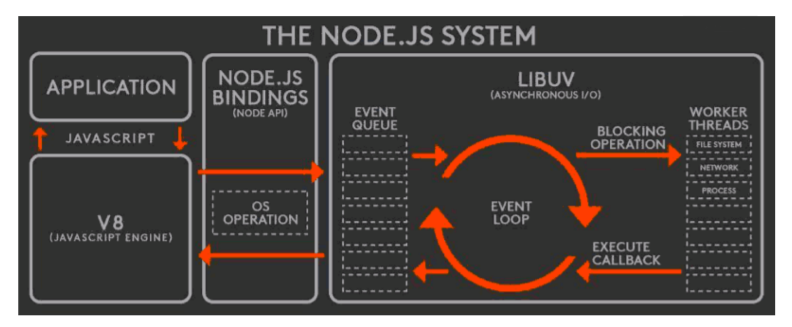

# Node 本质与机制


## Node 是什么


### 概述


Node 不是一门语言，也不是一个框架，而是基于 Chrome V8 引擎的 JavaScript 运行时环境；结合 libuv 拓展了 JavaScript 的功能，使其能够支持浏览器的 Dom 操作，同时具有后端语言才有 I/O，文件读写和操作数据库的能力。

Node.js 最擅长处理高并发，在 Java，PHP，net 等服务端语言中，会为每个客户端连接创建一个新的线程。理论上，一台 8GB 内存的服务器可同时连接的最大用户数约为 4000 个（每个线程耗费约 2MB 内存）。想让 web 程序支持更多用户就需要增加服务器数量。Node.js 并不是为每个客户端创建一个新的线程，而是仅仅使用一个线程。当有客户端连接了，就触发一个内部事件，通过非阻塞 I/O、事件驱动机制，让 Node.js 程序在宏观上并行。使用 Node.js，一台 8GB 服务器可同时处理超过 4 万用户的连接。


### 非阻塞 I/O


`I/O` 是 `input` 和 `output` 的缩写，表示计算机输入输出。

阻塞 `I/O`：当程序走到 `I/O` 操作的时候，程序会调用操作系统更底层的命令来完成操作，期间程序必须等待底层命令的结果返回，才能进行下一条程序语句的执行。

非阻塞 `I/O`：程序进行到 `I/O` 操作的时候，主程序开始调用底层命令，但是主程序不需要一直等待底层命令的返回，而是执行下一条程序语句。等到底层 `I/O` 有结果返回的时候，主程序再去决定丢弃还是处理。

**阻塞 `I/O` 和非阻塞 `I/O` 区别就在于系统在接入输入到输出期间，能否接收其他输入。**


### 事件驱动


`I/O` 操作完成后主程序是如何感知的？

底层 `I/O` 操作完后会触发这个事件并执行相关的处理函数，内部的实现是一个**观察者模式**。

`libuv` 提供两个最重要的东西是**事件循环和线程池**，两者共同构建异步非阻塞 `I/O` 模型。事件驱动是在整个非阻塞 `I/O` 中线程池通知事件循环它已经完成 `I/O` 操作的一种机制。


### 事件循环


问题产生：JavaScript 单线程，是一个阻塞模式，异步等待结果返回才可进入下一步，于是引入事件循环机制来解决这个问题

是什么：JavaScript 分为同步任务和异步任务

- 同步任务：立即执行，进入主线程
- 异步任务：异步执行，不进入主线程，有了结果后等待主线程有空闲时读取


#### 六个阶段

- timers 阶段：这个阶段执行 timer（setTimeout、setInterval）的回调
- I/O callbacks 阶段 ：处理一些上一轮循环中的少数未执行的 I/O 回调
- idle, prepare 阶段 ：仅 node 内部使用
- poll 阶段 ：获取新的 I/O 事件, 适当的条件下 node 将阻塞在这里
- check 阶段 ：执行 setImmediate() 的回调
- close callbacks 阶段：执行 socket 的 close 事件回调


每个阶段都有一个先入先出的回调队列，事件循环运行到每个阶段，都会从该阶段的回调队列中取出函数去执行，直到队列当中的内容耗尽，或执行的回调数量达到最大。然后事件循环进入下一个阶段，然后又从下一个阶段对应的队列中取出回调函数执行，这样反复直到事件循环的最后一个阶段。而事件循环也会一个一个按照循环执行，直到进程结束。


#### 宏任务和微任务

宏、微任务特征：1. 是一个回调函数；2. 是异步执行的回调函数。

Node 端事件循环中的异步队列也是这两种：`macro`（宏任务）队列和 `micro`（微任务）队列

常见的 macro-task：`setTimeout`、`setInterval`、 `setImmediate`、 `I/O`操作等。

常见的 micro-task：`process.nextTick`、`new Promise().then`(回调)等。为了让优先级更高的任务优先执行


**宏任务队列和微任务队列在宏观上只是个概念，在 node 中没有说哪个具体队列名字就叫宏任务队列，正确的认知应该是前面我们说的事件循环当中的 6 个阶段对应的 6 个基本的队列都属于宏队列。**


事件循环当中的 6 个宏队列和微队列的关系如下：**微队列（microtask）在事件循环的各个阶段之间执行，或者说在事件循环的各个阶段对应的宏队列（macrotask）之间执行**。


#### process.nextTick


这个函数是独立于 `Event Loop` 之外的，它有一个自己的队列，当宏任务每个阶段完成后，在下个阶段之前（6 个阶段），如果存在 `nextTick` 队列，就会清空队列中的所有回调函数，并且**优先于其他 `microtask` 执行**。


#### **整个系统的任务调度**


1. 执行全局的同步代码，执行完毕之后，开启 for 循环模式；
2. 读取全局同步代码对应的微任务队列并且执行完毕；
3. 再继续执行此时需要执行的宏任务；
4. 执行完宏任务后，继续执行对应的微任务队列，清空微任务队列；
5. 接着继续执行此时需要执行的宏任务；
6. 周而复始，像一个循环一样。


#### eventloop




# 核心模块


## 模块-buffer


Buffer 类是作为 Node.js API 的一部分引入的，用于在 TCP 流、文件系统操作、以及其他上下文中与八位字节流进行交互。


### 核心概念


#### 二进制

二进制数据使用 `0` 和 `1` 两个数码来表示数据，为了存储或展示一些数据，计算机需要先将这些数据转换为二进制来表示。

例如我们对一个英文字母 `L` 操作，在 `JavaScript` 里通过 `'L'.charCodeAt()` 取到对应的 ASCII 码之后会转为二进制表示，所以对于这种字母 `L`，计算机会先将其转化成为数字 `76`，再将数字转化成为二进制数据。

计算机将字母转换为数字的规则是通过**字符集**。


#### 字符集

字符集已经定义好的表示每个字符的确切数字的规则。


#### 字符编码

简单来说，就是用多少位来表示数字。这叫做字符编码。

字符编码的一个规则是 `UTF-8`。`UTF-8` 声明字符应该以 `bytes` 编码。一个 byte 是 8 位（bit）的集合 —— 8 个 1 和 0。因此，UTF-8 规定应该使用 8 个 1 和 0 来表示二进制中任何字符。

目前所支持的字符编码有：

- ascii - 仅适用于 7 位 `ASCII`数据。此编码速度很快，如果设置则会剥离高位。
- utf8 - 多字节编码的 `Unicode` 字符。许多网页和其他文档格式都使用 `UTF-8`。
- utf16le - 2 或 4 个字节，小端序编码的 Unicode 字符。支持代理对（U+10000 至 U+10FFFF）。
- ucs2 - `utf16le` 的别名。
- base64 - `Base64`编码。当从字符串创建`Buffer`时，此编码也会正确地接受 RFC 4648 第 5 节中指定的 “URL 和文件名安全字母”。
- latin1 - 一种将`Buffer`编码成单字节编码字符串的方法（由 RFC 1345 中的 IANA 定义，第 63 页，作为`Latin-1`的补充块和 C0/C1 控制码）。
- binary - `latin1` 的别名。
- hex - 将每个字节编码成两个十六进制的字符。


#### stream

流，英文 `Stream` 是对输入输出设备的抽象，这里的设备可以是文件、网络、内存等, 而 **JavaScript 中的 Stream 只是表示随着时间的推移从一个点移动到另一个点的数据序列**。当有一些大文件操作时，我们就需要 `Stream` 像管道一样，一点一点的将数据流出。


#### Buffer

如果数据到达的速度比进程消耗的速度快，那么少数先到达的数据会处于等待区等候被处理。反之，如果数据到达的速度比进程消耗的数据慢，那么早先到达的数据需要等待一定量的数据到达之后才能被处理。这里的等待区就指的缓冲区（Buffer），它是计算机中的一个小物理单位。

Buffer 是一个类似于数组，默认以十六进制来保存资源在计算机当中的二进制形式。


## 模块-stream


### 什么是流？

在 `node` 当中 `stream` 是一种处理流数据的抽象接口，`stream` 模块提供了一系列实现流的 API，在 `node` 当中提供了很多关于流的对象，流是可读写的，所有的流都是 `EventEmitter` 的实例。


### 为什么使用流？

在手机上看电影的例子：

使用流的话，那么在看电影就好比管道通水，一点一点地从服务端将视频数据流入手机播放器，一边流动一边播放视频。这样就不会占用太多的内存（我们网速、内存、CPU 速度都是有限的）。

如果不使用流呢？那就得先从服务端加载完全部的视频文件，再播放，这样导致的问题最直观就是需要很长的时间来获取视频文件。加载过程中也可能会因为内存占用过多导致系统崩溃。

因为一次性读取、操作大文件，内存和网络是「吃不消」的，因此要让数据流动起来，一点一点的进行操作，数据通过管道流动给客户端，大大减轻了服务器的压力。这其实也符合算法中一个很重要的思想 —— 分而治之。


### **读取大文件**

```js
const http = require("http");
const fs = require("fs");
const path = require("path");

const server = http.createServer(function (req, res) {
  const fileName = path.resolve(__dirname, "data.txt");
  fs.readFile(fileName, function (err, data) {
    res.end(data);
  });
});
server.listen(8000);
```

语法上并没有什么问题，但是如果 `data.txt` 文件非常大的话，到了几百 M，在响应大量用户并发请求的时候，程序会消耗大量内存，这样可能造成用户连接缓慢。而且并发请求过大的话，服务器内存开销也会很大。

我们可以使用 `stream` 来解决问题，这样就不需要把文件全部读取了再返回，而是一边读取一边返回，数据通过管道流动给客户端，大大减轻了服务器的压力。

```js
const http = require("http");
const fs = require("fs");
const path = require("path");

const server = http.createServer(function (req, res) {
  const fileName = path.resolve(__dirname, "data.txt");
  let stream = fs.createReadStream(fileName); // 这一行有改动
  stream.pipe(res); // 这一行有改动
});
server.listen(8000);
```


## 模块-fs


### 文件读取-fs.readFile

`fs.readFile(filename,[encoding],[callback(error,data))`

1. 它接收第一个必选参数 filename，表示读取的文件名；
2. 第二个参数 encoding 是可选的，表示文件字符编码；
3. 第三个参数 `callback` 是回调函数，用于接收文件的内容

如果不指定 encoding ，则 `callback` 就是第二个参数。 回调函数提供两个参数 err 和 data ， err 表示有没有错误发生，data 是文件内容。

如果指定 encoding ，则 data 是一个解析后的字符串，否则将会以 Buffer 形式表示的二进制数据。

```js
const fs = require("fs");
const path = require("path");
const filePath1 = path.join(__dirname, "data1.txt");

// 异步读取文件 -- calllback data 获取文件内容
fs.readFile(filePath1, "utf8", function (err, data) {
  console.log(data); // this is data1
});
// 同步读取文件 -- 直接返回文件内容
const fileResult = fs.readFileSync(filePath1, "utf8"); // this is data1
```


### 文件写入-fs.writeFile

`fs.writeFile(filename,data,[options],callback)`

1. 第一个必选参数 filename ，表示读取的文件名
2. 第二个参数要写的数据
3. 第三个参数 option 是一个对象

```js
// 写入时会先清空文件
fs.writeFile(filePath, "new content..", function (err) {
  if (err) {
    throw err;
  }
  // 写入成功后读取测试
  var data = fs.readFileSync(filePath, "utf-8");
  console.log("new data -->" + data);
});
```


### 文件追加-fs.appendFile

`fs.appendFile(filename, data, [options], callback)`

1. 第一个必选参数 filename ，表示读取的文件名
2. 第二个参数 data，data 可以是任意字符串或者缓存
3. 第三个参数 option 是一个对象，与 write 的区别就是 [options] 的 flag 默认值是”a”，所以它以追加方式写入数据

```js
// 写入文件内容（如果文件不存在会创建一个文件）
fs.appendFile(filePath, "add content..", function (err) {
  if (err) {
    throw err;
  }
  // 写入成功后读取测试
  var data = fs.readFileSync(filePath, "utf-8");
  console.log(data);
});

// -- 同步另一种文件追加操作(非覆盖方式)
fs.appendFileSync(filePath, "同步追加一条新数据程序员成长指北789");
```


### 拷贝文件-fs.copyFile

`fs.copyFile(filenameA, filenameB，callback)`

1. 第一个参数原始文件名
2. 第二个参数要拷贝到的文件名

```js
// 将 filePath 文件内容拷贝到 filePath1 文件内容 filepath1 文件内容会被覆盖
fs.copyFileSync(filePath, filePath1);
let data = fs.readFileSync(filePath1, "utf8");
```


### 删除文件-fs.unlink

`fs.unlink(filename, callback)`

1. 第一个参数文件路径
2. 第二个回调函数 callback

```js
// -- 异步文件删除
fs.unlink(filePath, function (err) {
  if (err) return;
});
// -- 同步删除文件
fs.unlinkSync(filePath, function (err) {
  if (err) return;
});
```


## 模块-http


**创建一个后台服务**

```js
const http = require("http");
const server = http.createServer((request, response) => {
  // magic happens here!
});
```


**获取请求头 方法 访问地址**

```js
const { header, method, url } = request;
```


**请求体**

每次在 `data` 事件中触发抓获的数据块是一个 Buffer。如果你知道是个字符串对象，那最好把这些数据收集到一个数组中，然后在 `end` 事件中拼接并将它转化为字符串。

```js
let body = [];
request
  .on("data", (chunk) => {
    body.push(chunk);
  })
  .on("end", () => {
    body = Buffer.concat(body).toString();
  });
```


**监听错误**

```js
request.on("error", (err) => {
  console.error(err.stack);
});
```


**HTTP 状态码**

```js
response.statusCode = 404;
```


**设置响应头**

```js
response.setHeader("Content-Type", "application/json");
response.setHeader("X-Powered-By", "bacon");
```

**显式发送头数据**

```js
response.writeHead(200, {
  "Content-Type": "application/json",
  "X-Powered-By": "bacon",
});
```


**发送返回体**

```js
response.write("<html>");
response.write("<body>");
response.write("<h1>Hello, World!</h1>");
response.write("</body>");
response.write("</html>");
response.end();
//或者
response.end("<html><body><h1>Hello, World!</h1></body></html>");
```


## 核心模块-net


### TCP 协议

`TCP` 是传输控制协议，它是一个更可靠的数据传输协议，具有如下三个特点：

- 面向链接：需要对方主机在线，并建立链接，好比两端通话一样；
- 面向字节流：为了方便数据传输，将大块的数据分割成以报文段为单位的数据包进行管理；
- 可靠：三次握手保证通信可靠性，若握手过程中莫名中断，TCP 会再次以相同的顺序发送相同数据包
  - 第一次：发送端发送正常
  - 第二次：接收端接收和发送正常
  - 第三次：发送端接收正常


### 使用 net 创建 TCP 链接


服务端代码

```js
const net = require('net')

// 创建一个TCP服务实例
const server = net.createServer()

// 监听端口
server.listen(PORT, HOST)

// 当我们使用server.listen就会产生listening事件
server.on('listening', ()=> {
  console.log(`服务已经开启在${HOST}:${PORT}`)
})

// 当服务端接收到数据就会产生connection事件
server.on('connection', socket => {
  socket.on('data', buffer => {
    console.log(`我已经接收到你的数据为：${msg}`)

    // 使用wirte方法向客户端返回信息
    socket.write(Buffer.from(`${msg} - alreadyget`))
  })
})

// 当服务端主动执行server.close或者所有链接结束会产生close事件
server.on('close',()=> {
  console.log('服务已经关闭')
})

// 当服务端发生异常的时候会触发error事件的发生
server.on('error',err => {
  ...
})
```


客户端代码

```js
const net = require('net')

const client = net.createConnection({
  host: '127.0.0.1',
  port: '4000'
})

// 当使用了net.creatConnection成功建立连接后会触发connect事件
client.on('connect',()=>{
  console.log('链接成功，开始发送数据')
  setTimeout(() => {
   ...
  },1000)
})

// 客户端收到信息就会触发data的事件
client.on('data', buffer => {
  console.log(`我收到服务器返回的数据为: ${buffer.toString()}`)
})

client.on('error',err => {
  console.log('客户端异常',err)
})

client.on('close',(err) => {
  console.log('客户端连接断开',err)
})
```


**TCP 服务事件（server）**

- listening：也就是 `server.listen()`;
- connection：新链接建立时触发，参数 `socket` 为 `net.createServer` 实例
- close：当 `server` 关闭的时候触发（server.close()）。如果有连接存在，直到所有的连接结束才会触发这个事件
- error：捕获错误，例如监听一个已经存在的端口就会报 `Error: listen EADDRINUSE` 错误


**TCP 链接事件（socket）**

- data：如果一端调用 `write()` 方法发送数据，另一端可通过 `socket.on('data')` 事件进行监听
- end：每次 `socket` 链接会出现一次，例如客户端发送消息之后执行 `Ctrl + C` 终端
- error：监听 `socket` 的错误信息
- write：`write` 是一个方法，`write` 方法是写数据到另一端


# CommonJS 模块规范


## 认识 CommonJS


### 为啥需要模块化

早期的 JavaScript 容易产生**全局污染**和**依赖管理**的混乱问题。

全局污染：在引入多个 js 文件时，js 内部的变量会相互污染。

依赖管理：正常情况下，js 执行的先后顺序是依照 script 标签排列的顺序。下层的 js 只能调用上层 js 中暴露出的变量和方法。

CommonJS 的提出是为了解决上述两个的问题。nodejs 借鉴了 CommonJS 的 Module，实现良好的模块管理。


### CommonJS 使用场景

commonjs 使用于以下几个场景

1. Node 是 CommonJS 在服务器端一个具有代表性的实现；
2. Browserify 是 CommonJS 在浏览器中的一种实现；
3. webpack 打包工具对 CommonJS 的支持和转换；也就是前端应用也可以在编译之前，尽情使用 CommonJS 进行开发。


### CommonJS 特点

1. commonjs 中每个 js 文件都是单独的模块，称之为 Module；
2. commonjs 核心变量：exports、module.exports、require；
3. exports、module.exports 负责导出；
4. requrie 负责导入（自定义模块、系统模块、第三方模块）；


### CommonJS 实现原理

每个模块文件存在 module、exports、require 3 个变量：

- module：记录当前模块信息；
- requrie：引入模块方法；
- exports：当前模块导出属性；

```javascript
// 包装后
(function (exports, require, module, __filename, __dirname) {
  // 原代码
  const sayName = require("./hello.js");
  module.exports = function say() {
    return {
      name: sayName(),
      author: "我不是外星人",
    };
  };
});
// 包装函数长这样
function wrapper(script) {
  return (
    "(function (exports, require, module, __filename, __dirname) {" +
    script +
    "\n})"
  );
}
// 包装函数执行后
const modulefunction = wrapper(`
  const sayName = require('./hello.js')
    module.exports = function say(){
        return {
            name:sayName(),
            author:'我不是外星人'
        }
    }
`);
// 最终返回
runInThisContext(modulefunction)(
  module.exports,
  require,
  module,
  __filename,
  __dirname
);
```


## require

require 接收的唯一参数是一个**标识符**，commonjs 对不同的标识符处理不同，但目的都是为了找到相应的模块。


### requrie 加载标识符原则

1. 首先像 fs ，http ，path 等标识符，会被作为 nodejs 的核心模块，加载速度最快。
2. `./`和 `../`作为相对路径的文件模块， `/` 作为绝对路径的文件模块，会提前将路径转换为绝对路径，编译后将结果缓存起来。
3. 非路径形式也非核心模块的模块，将作为自定义模块，遵循以下规则：
   - 在当前目录下的 node_modules 目录查找；
   - 如果没有，在父级目录的 node_modules 查找，以此类推；
   - 沿着路径向上递归，直到根目录下的 node_modules 目录；
   - 在查找过程中，会找 package.json 下 main 属性指向的文件，如果没有 package.json ，在 node 环境下会以此查找 index.js ，index.json ，index.node。


### require 模块引入与处理

commonjs 模块同步加载并执行模块文件，在执行阶段分析模块依赖，采用「**深度优先遍历**」，执行顺序：父-子-父。


### **require 加载原理**

首先弄清楚两个概念：module 和 Module。

module：node 中每一个 js 文件都是 module，module 除了保存 exports 信息外，还有 loaded，表示该文件是否被加载。

Module：nodejs 为例，整个系统运行后，会用 Module 缓存每一个模块加载的信息。


### **require 源码**

```javascript
// id 为路径标识符
function require(id) {
   /* 查找  Module 上有没有已经加载的 js  对象*/
   const  cachedModule = Module._cache[id]

   /* 如果已经加载了那么直接取走缓存的 exports 对象  */
  if(cachedModule){
    return cachedModule.exports
  }

  /* 创建当前模块的 module  */
  const module = { exports: {} ,loaded: false , ...}

  /* 将 module 缓存到  Module 的缓存属性中，路径标识符作为 id */
  Module._cache[id] = module
  /* 加载文件 */
  runInThisContext(wrapper('module.exports = "123"'))(module.exports, require, module, __filename, __dirname)
  /* 加载完成 *//
  module.loaded = true
  /* 返回值 */
  return module.exports
}
```


**大概流程是这样子的**

- require 接收一个参数（文件标识符），分析定位文件，然后会从 Module 上查找有没有缓存，如果有缓存，那么直接返回缓存的内容。

- 如果没有缓存，会创建一个 module 对象，缓存到 Module 上，然后执行文件，加载完文件将 loaded 属性设为 true ，然后返回 module.exports 对象。借此完成模块加载。

- 模块导出就是 return 这个变量，其实跟 a = b 赋值一样， 基本类型导出的是值， **引用类型导出的是引用地址**。

- exports 和 module.exports 持有相同引用，因为最后导出的是 module.exports， 所以对 exports 进行赋值不会对 module.exports 的引用产生影响。


### **require 动态加载**

require 本质上是一个函数，这就意味着 require 可以在任意上下文中执行，自由加载其他模块的属性和方法。


## exports 和 module.exports


### exports 使用

```javascript
// exports.xxx
exports.name = `《React进阶实践指南》`;
exports.author = `我不是外星人`;
exports.say = function () {
  console.log(666);
};
// 引用
const a = require("./a");
console.log(a);
```

exports 就是传入到当前模块内的一个对象，本质上是 module.exports。


**`exports={}`为啥不行呢？**

我们知道 exports， module 和 require 是以形参的方式传入到 js 模块中。我们直接 `exports = {}` 修改 exports ，等于重新赋值了形参，将导致模块不会在引用原来的形参，这是 js 语言自身特性。应该改成 `exports.xxx=xxx`。


### **module.exports 使用**

module.exports 本质上就是 exports

```javascript
module.exports = {
  name: "ming",
  age: 12,
  say() {
    console.log(666);
  },
};
```


**有了 exports 为啥还要 module.exports ？**

我们知道 `exports` 会被初始化成一个对象，如果我们只导出一个**类或一个函数**再或者其他属性的情况呢？

这时候就可以通过 `module.exports` 自定义导出**除对象外的其他类型元素**。


## CommonJS 总结


- CommonJS 模块由 JS 运行时实现。
- CommonJs 是单个值导出，本质上导出的就是 exports 属性。
- CommonJS 是可以动态加载的，对每一个加载都存在缓存，可以有效的解决循环引用问题。
- CommonJS 模块同步加载并执行模块文件。


## ES Module 总结


- ES6 Module **静态**的，不能放在块级作用域内，代码发生在编译时。
- ES6 Module 和 CommonJS 一样，对模块有缓存机制，处理时采用深度优先遍历。
- ES6 Module 可以导出多个属性和方法，可以单个导入导出，混合导入导出。
- ES6 Module 导入模块在严格模式下。
- ES6 Module 的特性可以很容易实现 Tree Shaking 和 Code Splitting。


# 异步编程


## 异步概念


在异步调用当中，我们自己是无法独自完成异步，必须依靠某个东西和我们共同完成，这就是中间人。

中间人要做的就是 3 件事：

1. 接收异步请求
2. 发生异步交互
3. 返回异步响应


### 浏览器中的异步


浏览器当中异步模式是依赖于 `Ajax` 的，而 `Ajax` 中的核心中间人就是 `XMLHttpRequest`。

`Ajax` 定义好请求和回调函数后，剩下的事情就交给 `XMLHttpRequest` 处理，`XMLHttpRequest` 会和服务器交互，并产生时间差，所以异步操作能够很好的解决问题，不需要刷新页面就能获取数据。


### node 中的异步


`Node ` 中异步模式是依赖于异步非阻塞 I/O 模型的，而这种模型中的核心，或者核心中间人就是 `EventLoop`。

我们在调用 `Node API` 方法时，会把具体操作和回调函数交给 `EventLoop` 去执行，`EventLoop` 维护了一个事件队列，当异步函数执行的时候，会把回调函数放进事件队列当中。

`V8` 引擎直到异步函数执行完成才会开始处理 `EventLoop` ，这意味着 `JavaScript` 代码不是多线程的，即使好像看起来能同时执行多个线程的任务。


### 异步的优缺点


同步方式容易理解，但会造成线程阻塞，无法最大限度的利用系统资源。

异步解决了这个问题，它能够并行执行任务，让性能得到大的提升。

异步最大的问题是**可控性**问题，如执行结果不是我们想要的，该怎么去控制？因为异步执行的结果具有**不确定性**。


## node 自带的异步


`node` 中有两种事件处理的方式，分别是 `callback`（回调）和 `EventEmitter`（事件发射器）。

`callback` 采用的是错误优先的回调方式，`EventEmitter` 采用的是事件驱动当中的事件发射器。


### 1.callback


`callback` 采用错误优先的回调方式，注意两条规则即可：

- `callback` 第一个参数返回 `error` 对象，如果错误发生该对象会作为第一个参数返回；如果执行正常，一般做法是将 `error` 返回`null`；
- `callback` 第二个参数返回的是成功响应的结果数据，如果结果正常，那么参数 `err` 就会被设置为 `null`，并在第二个参数上面返回正确结果。

```js
interview(function (err, res) {
  if (err) {
    return console.log("cry");
  }
  return console.log("smile");
});

function interview(callback) {
  setTimeout(() => {
    if (Math.random() < 0.2) {
      callback(null, "success");
    } else {
      // thorow new Error('fail')
      // 因为在 settimeout 里，所以错误会抛到全局，可以用 callback 出去
      callback(new Error("fail"));
    }
  }, 500);
}
```


**callback 存在的问题**


**1.容易产生回调地狱**

```js
// 比如多轮面试 直到第3轮才成功
// 第1轮
interview(function (err, res) {
  if (err) {
    return console.log("cry");
  }
  // 第2轮
  interview(function (err, res) {
    if (err) {
      return console.log("cry");
    }
  });
  // 第3轮面试
  interview(function (err, res) {
    if (err) {
      return console.log("cry");
    }
  });

  return console.log("smile");
});
```


**2.异步并发控制**

比如同时面试两家公司，那么就需要写两个 `interview` 函数来进行控制。


**3.社区解决方案**

npm：async.js


### 2.EventEmitter

事件模块是 `Node.js` 内置的对观察者模式的实现。通过 `EventEmitter` 属性提供一个构造函数，该构造函数有两个常用的方法：

- `on`方法可以用来监听指定事件，并触发回调函数；
- `emit` 方法可以用来发布事件。

```js
const EventEmitter = require("events");
const observer = new EventEmitter();

observer.on("topic", function () {
  console.log("topic has occured! ");
});

function main() {
  console.log("start");
  observer.emit("topic");
  console.log("end");
}
main(); // start; topic has occured ; end
```


## Promise


`Promise` 可以说是对回调地狱的思考和解决方案，是在 `Async-Await` 出现之前唯一普遍的通用规范。

`promise` 要点：

- 递归：每个异步操作返回的都是 `Promise` 对象
- 状态机： 三种状态转移，只在 `Promise` 对象内部可以控制，不可在外部改变状态
- 全局异常处理

执行 `.then` 和 `.catch` 会返回一个新的 `Promise`，该 `Promise` 最终状态根据 then 和 catch 的回调函数执行结果决定：

- 如果回调函数结果是 `throw`，该 `Promise` 是 `reject` 状态；
- 如果回到函数结果是 `return`，该 `Promise` 是 `resolve` 状态；
- 如果回调函数最终返回一个 `promise`，该 `promise` 会和回调函数 `return` 的 `promise` 状态保持一致


## async -await


async await 是 Promise 的语法糖，返回结果都是 Promise

```JavaScript
var asyncfunc = async function () {
  return 4;
}
// Promise {4}
var promise = function () {
  return new Promise((resolve) => {
    resolve(4);
  });
}
// Promise {4}
```


异步编程的终极解决方案：以同步的方式写异步

- await 关键字可以暂停等待 async function 的执行
- await 关键字可以以同步的写法获取 Promise 的执行结果
- try-catch 可以捕获 await 所存在的错误

```js
const result = (async function () {
  var content = await new Promise((resolve, reject) => {
    setTimeout(() => {
      resolve(6);
    }, 500);
  });
  console.log(content); // 6  -- 等待执行完成后赋值结果6
  return 4;
})();

setTimeout(() => {
  console.log(result); // promsie fulfilled
}, 800);
// 6   Promise {4}
```


多个任务并发控制

```js
try {
  await interview(1);
  await interview(2);
  await interview(3);
} catch (error) {
  return console.log("cry at " + error.round);
}
console.log("smile");
```


并行的异步任务控制

```js
try {
  await Promise.all([interview(1), interview(2), interview(3)]);
} catch (error) {
  return console.log("cry at " + error.round);
}
```


# koa 与 express


## koa

基于 Node.js 的 HTTP 的中间件框架。


### 基础用法


**创建 HTTP 服务**

```js
const Koa = require("koa");
const app = new Koa();
app.listen(3000);
```


**Context 对象**

Koa 提供一个 Context 对象，表示一次对话的上下文（request 和 response）。通过加工，就能控制返回给用户的内容。

```js
const app = new Koa();

app.use((ctx) => {
  ctx.body = "Hello World";
});
app.listen(3000);
```


**Response 类型**

```js
app.use((ctx) => {
  ctx.type = 200;
});
```


**网页模板**

实际开发中，返回给用户的网页往往都写成模板文件。

```js
app.use((ctx) => {
  ctx.type = "html";
  ctx.body = fs.createReadStream(__dirname + "/template.html");
});
```


### 路由


通过 `ctx.path` 可以获取用户请求的路径，由此实现简单的路由。

```js
app.use((ctx) => {
  if (ctx.path !== "/") {
    ctx.type = "html";
    ctx.body = '<a href="/">Index Page</a>';
  } else {
    ctx.body = "Hello World";
  }
});
```


**koa-router 模块**

```js
const route = require("koa-route");
const about = (ctx) => {
  ctx.type = "html";
  ctx.body = '<a href="/">Index Page</a>';
};
const main = (ctx) => {
  ctx.body = "Hello World";
};
app.use(route.get("/", main));
app.use(route.get("/about", about));
```


**静态资源**

如果网站提供静态资源（图片、字体、样式表、脚本等），为它们一个个写路由就很麻烦，也没必要。`koa-static` 模块封装了这部分的请求。

```js
const path = require("path");
const static = require("koa-static");

app.use(static(path.join(__dirname)));
```


**重定向**

```js
const redirect = (ctx) => {
  ctx.redirect("/");
  ctx.body = '<a href="/">Index Page</a>';
};
app.use(route.get("/redirect", redirect));
```


### 中间件


我们每次使用 `app.use` 就是在使用一个中间件，中间件的本质是一个 `async` 修饰的函数，所以返回的是个 `Promise` 对象。

因为是异步操作，所以需要使用 `await` 来修饰 `next`。

```js
const koa = require("koa");
const app = new koa();

app.use(async (ctx, next) => {
  console.log(1);
  await next();
  console.log(2);
  ctx.body = "hello RESTful API";
});

app.use(async (ctx, next) => {
  console.log(3);
  await next();
  console.log(4);
});

app.use(async (ctx, next) => {
  console.log(5);
});
app.listen(3000);
// 1 -> 3 -> 5 -> 4 -> 2
```


### 错误处理


**500 错误**

```js
ctx.throw(500);
```


**404 错误**

```js
ctx.status = 404;
```


**处理错误中间件**

使用 `try...catch` 在最外层捕获

```js
const handler = async (ctx, next) => {
  try {
    await next();
  } catch (err) {
    ctx.status = err.statusCode || err.status || 500;
    ctx.body = {
      message: err.message,
    };
  }
};

const main = (ctx) => {
  ctx.throw(500);
};

app.use(handler);
app.use(main);
```


# 性能调优


## http 服务器性能检测


### **1.压测工具**

ab(Apache bench)


### **2.压测过程**

压测命令：`ab -c200 -n1600 http://127.0.0.1:3000/download/`

- -c：concurrency，指定压力测试的并发数。模拟当前共有多少个客户端在同时请求。
- -n：requests，用于指定压力测试总共的执行次数。

服务器性能分析，主要看 4 个参数：

- Requests per second(**QPS**)：（重要）平均每秒的请求数，也就是服务器能最大承受的每秒并发量
- Time per request：200 个用户每次请求所花平均时间
- Time per request：单个用户请求一次的平均时间
- Transfer rate(吞吐量)：传输速率，或者吞吐量（有多少数据量的交互），对比网卡带宽


### **3.服务器性能瓶颈猜测**

服务器的性能瓶颈主要和 CPU、硬盘、网卡有关。可以通过 linux 配合压力测试，找出限制服务器性能的原因。

- top：通过跑 `top` 命令来监控 **cpu** 和**内存**使用情况的，根据占比分析哪里限制了服务器；
- iostat：检测各个 I/O 设备的带宽，判断硬盘是否跟得上；

基本上在服务器确定的情况下，我们大部分问题其实是我们书写的 `Node-BFF` 层，而且就在 cpu 运算上。


## Node 性能分析与优化


### 1.profile 工具

- `node --prof entry.js` 生成 `isolate-xxx-v8.log` 文件（空文件）
- 执行压测 15 秒的命令 `ab -c50 -t15 http...` 在 `isolate-xxx-v8.log` 文件中生成内容
- `node --prof-process isolate-xxx-v8.log > profile.txt` 将 log 文件中的东西进行分析，生成 `profile.txt` 文件


### 2.Chrome devtool


**CPU 检测**

- `node --inspect-brk entry.js` 启动程序，会发现一开始就 debug 暂停
- 打开 `chrome://inspect`，点击最下面的`Target`进入调试
- devtools 有两个 `Tab`，一个是 Memory，一个是 Profiler，分别表示的内存和 cpu 的检测
- 在 Profiler 当中点击 `Start CPU profiling` 按钮
- 执行 `ab -c50 -t15 http://localhost:3000/download/`，开始 15 秒的压测
- 然后回到 `Profiler` 的当中点击 `stop` 的按钮，就能根据从上到下的耗时去优化


**计算性能优化本质**

- 减少不必要计算：如把小图合成大图(雪碧图)，减少 http 的请求次数，减少 tcp 断链、http 编解包和图片编码的消耗
- 空间换时间：比如把一些需要重复进行计算的结果缓存起来，在下次计算就能直接使用计算结果，达到性能优化
- 提前计算：尽可能把服务阶段的计算量移到启动阶段，就能够达到不错的优化效果


**内存检测**

- `node --inspect-brk entry.js` 启动程序一开始就会暂停
- 打开 `chrome://inspect`，点击最下面的`Target`进入调试
- 上面有两个`Tab`，一个是`Memory`,一个是`Profiler`，分别表示的内存和`cpu`的检测
- 执行 `ab -c50 -t15 http://localhost:3000/download/`，开始 15 秒的压测
- 压测到一半时，在 `Memory` 中点击 `Take heap snaphot` ，生成内存快照
- 压测结束时，在 `Memory` 中再次点击 `Take heap snaphot`，生成内存快照
- 然后点击 `Comparison `来对比两次快照的变化，通过观察 `Alloc.Size` 和 `Freed.Size` 的差值看到`Size Delta`，观察内存是否存在泄露
- 如果 `snaphot1` 和 `snaphot2` 差距比较大（snapshot1<snapshot2），说明内存没有得到释放，是存在内存泄漏的。


**内存性能优化实现**

- 减少内存使用
- 必要时检查内存是否泄露


NodeJS Buffer 的内存分配策略：当创建第一个 buffer，node 会去创建一个 chart 数组，如果 buffer 小于 8kb，那么 node 会将该 buffer 填充到 chart 里面，后面有新的 buffer 创建就会自动填充到 chart；如果 buffer 被销毁了，那么在 chart 占据的空间则会腾出来给下一个新的 buffer 使用，一点也不会浪费空间，以达到对内存充分的使用，最大程度减少内存消耗。这个思想和「**池**」一样的。

所以，节省内存最好的方式是：**使用池**


## 内存管理优化


### 垃圾回收机制


#### 什么是 GC？

程序工作过程中会产生很多垃圾，这些垃圾是程序不用的内存，而 `GC` 就是负责回收垃圾的。


#### 垃圾产生&为何回收

我们写代码时创建一个基本类型、对象、函数等都是需要占用内存的。举个例子，我们声明了一个变量 `test`，它引用了对象 `{name: 'isboyjc'}`，接着我们把这个变量重新赋值了一个数组对象，那么之前的对象引用关系就没有了。这些无用的对象多了就会占用大量的内存空间，所以需要被清理。


#### 垃圾回收策略


##### 标记清除法

大致过程就像它的名字一样，此算法分为标记和清除两个阶段，标记阶段即为所有活动对象做上标记，清除阶段则把没有标记（也就是非活动对象）销毁。

步骤：

1. 在运行时给内存中的所有变量都加上一个标记，并且都假设是垃圾，标记为 0；
2. 从根对象（遍历所有对象的出发点）开始遍历，把活动对象标记为 1；
3. 清理所有标记为 0 的非活动对象，销毁并回收它们占用的内存空间；
4. 把内存中所有对象再次标记为 0，等待下一轮垃圾回收。

优缺点：

优点：实现简单明了

缺点：清除之后，原本对象所占用的内存位置是不变的，导致内存空间不连续，出现内存碎片。


**标记整理法**解决内存碎片的问题：

即在标记结束后，标记整理算法会将存活着的对象内存向一端移动，最后清理掉边界内存，使剩余内存空间可连续。


#### V8 对 GC 的优化


##### 分代式垃圾回收

V8 的垃圾回收策略主要基于分代式垃圾回收机制，V8 将堆内存分为**新生代**和**老生代**两区域，采用不同的垃圾回收策略。

分代式机制把一些新、小、存活时间短的对象作为新生代，采用一小块内存快速清理，清理频率较高；

而把一些大、老、存活时间长的对象作为老生代，垃圾清理频率较低；

新老生代的回收机制及频率是不同的，提高了垃圾回收机制的效率。


**新生代垃圾回收**

新生代回收机制将堆内存一分为二，一个处于使用状态的空间我们称之为使用区，一个是处于闲置状态的空间我们称之为空闲区

新加入的对象都会存放到使用区，当使用区快被写满时，就需执行一次垃圾清理操作

当开始回收时，新生代垃圾回收器会对使用区中的活动对象做标记

标记完成后之后将使用区的活动对象复制进空闲区并进行排序（如果复制一个对象到空闲区时，内存占用超过了 25%，那么这个对象会被直接晋升到老生代空间中）

随后进入垃圾清理阶段，清除使用区的数据对象

最后进行角色互换，把原来的使用区变成空闲区，把原来的空闲区变成使用区

当一个对象经过多次复制后依然存活，说明是生命周期较长的对象，会被移动到老生代中


**老生代垃圾回收**

采用**标记清除法**对老生代垃圾进行回收，采用**标记整理法**对回收机制进行优化，使内存空间变得可连续。


## 多进程优化


### 什么是进程和线程？

由于 JavaScript 是单线程语言，因此无法在其中实现多线程。在这种情况下，有一个很好的解决方法：通过 Node.js 实现多线程。


**什么是进程？**-- 类似公司

- 操作系统挂载的运行程序的单元

- 拥有一些独立的资源，如内存等


**什么是线程？**-- 类似职员

- 比进程更小，进行运算调度的单元
- 进程内的线程共享进程内的资源

在 `node` 当中，事件循环和进程线程是分不开的，两者的关系是：

- 主线程运行 v8 与 javascript
- 多个子线程(libuv 提供)提供给事件循环调度


如何理解：主线程相当于公司里面的的老板，其他子线程相当于公司职员，js 主线程老板通过事件循环给其他线程员工分发任务。但这种机制也存在缺陷，即当老板的事情很多，而且 js 主线程只有一个线程，也只能用到 cpu 一个核。这会造成 cpu 的浪费，所以`node`提供了子进程和子线程，让其在别的`cpu`上也跑一个`javascript`环境。这种情况就相当于一个集团有多个子公司（cpu），每个子公司（单线程）可分配多名员工（子线程）执行工作。


**子进程的创建和使用**

```js
// index.js
const cp = require("child_process");
// 创建子进程，以child.js为入口文件
const child_process = cp.fork(__dirname + "/child.js");
// 父进程给子进程发送消息
child_process.send("haha");
// 父进程监听子进程发来的消息
child_process.on("message", (str) => {
  console.log("parent", str);
});

// child.js
// 子进程监听父进程发来的消息
process.on("message", (str) => {
  console.log("child", str);
  // 子进程给父进程发送消息
  process.send("hehe");
});
```


### cluster 模块


`cluster` 内置模块是 `Node` 官方特地为了网络服务而设计的，通过它我们可以快速的创建一个多核能力的网络服务程序。


如果计算机是 4 核的，那么我们可以选一个来创建主进程，将另外 3 个来创建子进程，利用进程之间强大的通信能力，主进程就啥事也不用做，只需要把任务发送给各个子进程，子进程完成请求后返回结果给主进程。如果要这么做的话，那么我们需要手动创建子进程和任务分发吗？答案是不用的，node 内置模块 `cluster` 可以帮助我们完成这些事。

```js
const cluster = require("cluster");
const os = require("os");
// 创建子进程
if (cluster.isMaster) {
  // os.cpus 获取本机核数，通常不会把 cpu 全部占满，一般除以 2 ，性能差不多但内存减少很多
  for (let i = 0; i < Math.floor(os.cpus().length / 2); i++) {
    createWorker();
  }

  // 监听到进程被 kill 后, 立即重启一个新的进程
  cluster.on("exit", () => {
    // 5秒后创建 避免频繁创建进程
    setTimeout(() => {
      createWorker();
    }, 5000);
  });

  // 创建子进程 对该进程进行心跳监控
  function createWorker() {
    var worker = cluster.fork();
    var missed = 0; // 子进程没有回应ping的次数

    // 心跳
    var timer = setInterval(function () {
      // 三次没回应，杀之
      if (missed == 3) {
        clearInterval(timer);
        console.log(worker.process.pid + " has become a zombie!");
        process.kill(worker.process.pid);
        return;
      }
      // 发送心跳
      missed++;
      worker.send("ping#" + worker.process.pid);
    }, 10000);

    // 监听心跳包回应
    worker.on("message", function (msg) {
      // 确认心跳回应
      if (msg == "pong#" + worker.process.pid) {
        missed--;
      }
    });

    // 挂了就没必要再进行心跳了
    worker.on("exit", function () {
      clearInterval(timer);
    });
  }
} else {
  // 当进程出现会崩溃的错误
  process.on("uncaughtException", (err) => {
    // 这里可以做错误上报的操作
    console.log(err);
    // 退出进程（官方建议）
    process.exit(1);
  });

  // 回应心跳信息
  process.on("message", function (msg) {
    if (msg == "ping#" + process.pid) {
      process.send("pong#" + process.pid);
    }
  });

  // 内存泄露监控：内存使用过多，自杀
  setInterval(() => {
    console.log(process.memoryUsage().rss); // 打印出内存
    // 对进程中-内存使用情况监控，如果大于 700M，则 kill 进程
    if (process.memoryUsage().rss > 734003200) {
      console.log("omm");
      process.exit(1);
    }
  }, 5000);
}
```


## 架构优化


### 动静分离

网页内容是分为静态和动态内容两个部分。将两种不同的文件分开部署，称为**动静分离**。


**静态内容**

- 基本不会变动（样式文件、图片），也不会因为请求参数不同而发生变化
- 解决：CDN （全国各地的 CDN 网络节点中选择一个最近的）分发，HTTP 缓存（CDN 上缓存副本）等


**动态内容**

- 各种因为请求参数不同而变动，且变动的数量几乎不可枚举（不能使用缓存）
- 解决：用大量的源站（相对 CDN，内容来源站点）机器承载，结合反向代理进行负载均衡


#### **nginx 静态内容服务**

```js
// 安装 nginx
yum install nginx
// 安装 node
yum install nodejs
// 启动 nginx
nginx
// 检查 nginx 安装是否成功
nginx -v
// 80端口 启动服务
netstat -nlp | grep 80
// nginx.conf 默认装在 /etc/nginx 目录下
cd /etc/nginx/
// static 文件夹下创建 index.html
mkdir static
touch index.html
// 将 html 代码 copy 到 index.html
vi index.html
// 修改 nginx.conf 的配置
root /root/static/; // 地址
user root; // root 用户创建，这里修改为 root，避免没有权限访问
// 重启 nginx
nginx -s reload
```


**nginx 输出与 nodejs 输出对比**

```js
// 创建 index.js 文件
const http = require("http");
const fs = require("fs");
const htmlBuffer = fs.readFileSync(__dirname + "/index.html");
http
  .createServer(function (req, res) {
    res.writeHead(200, { "content-type": "text/html" });
    res.end(htmlBuffer);
  })
  .listen(3000);
// 启动
node index.js
// 测试
curl http://127.0.0.1:3000/index.html
// 安装压测工具 ab
yum install httpd-tools
// 进入压测
ab -c 400 -n1600 http://127.0.0.1:3000/index.html
ab -c 400 -n1600 http://127.0.0.1:80/index.html
```

根据结果，可以看出使用 `nginx` 测试的 `QPS` 几乎是爆炸式输出，且吞吐量跑满整个网卡（瓶颈等于网络带宽量），**nginx 输出效率更高**。


#### 动态内容架构优化

主要体现在**反向代理**和**缓存服务**的使用。将请求分发到不同的 node 服务。


**nginx 反向代理**

```js
// node.conf
server {
    ...
    location ~/node/(\d*) {
        proxy_pass: http://127.0.0.1:3000/detail?columnid=$1
    }
    ...
}
// 重启 nginx
nginx -s reload
// 启动 nodejs
node index.js
// 输入 ip/node/123 -- 查看结果
```

nginx 接收到 url，进行匹配处理后转发给 nodejs，这样 nodejs 就不需要解析路径了。


**负载均衡**

```js
//node.conf
upstream node.com {
    server 127.0.0.1:3000;
    server 127.0.0.1:3001;
}
server {
    ...
    location ~/node/(\d*) {
        proxy_pass: http://node.com/detail?columnid=$1
    }
}
// 添加一个监听 3001 端口的文件，启动两个 node 服务
// 重启 nginx
nginx -s reload
```

重复刷新浏览器，发现浏览器会随机返回 3000 或者 3001 端口的文件内容，说明 `nginx` 把反向代理轮流代理到 3000 或 3001 端口的这两个 node 服务器。


**redis 缓存优化**

将请求成功的 `body` 内容写入（存储）`redis` 上，遇到下一次相同请求时就能命中该缓存，减少计算量，空间换时间。


# NPM


### 缓存清理

~~~js
// 清理
$ npm cache clean --force
// 查看npm缓存位置
$ npm cache dir
$ npm config list --json
~~~


