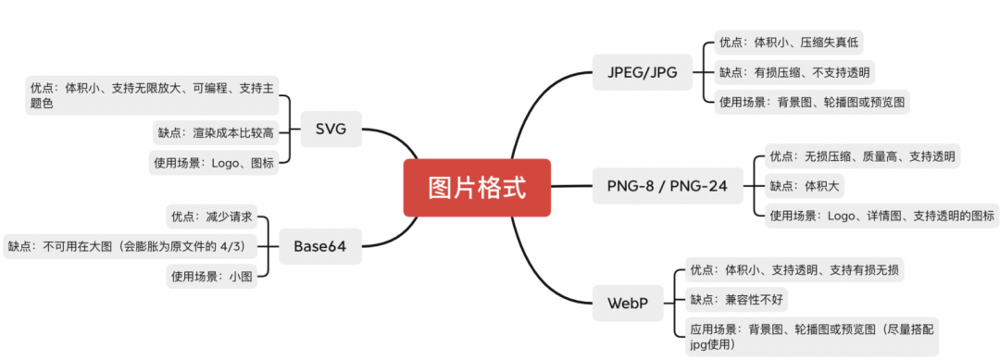

# 图片优化


## 压缩图片


https://tinypng.com/，其原理是通过有选择性地减少图像所要存储的颜色数量，从而减少图片的存储内存


## 图片格式



### JPEG/JPG

最常用的图像文件格式，背景图、轮播图、预览图常用

**优点**

- 支持极高的压缩率，可使文件传输、下载、预览速度大大加快
- 利用可变的压缩比控制文件大小
- 轻松地处理 1600 万种颜色，很好地再现全彩色的图像

**缺点**

在背景图和轮播图上展示良好，在处理矢量图或线条感较强、彩色对比明显的图像时，压缩导致图片模糊十分明显，所以不适合展示高清晰度、线条感较强烈的图像


### PNG-8 PNG-24

png 是一种采用无损压缩算法的位图格式，当你追求最佳的显示效果可用

**优点**

- 无损压缩
- 完全支持 alpha 透明度。
- 可以重复保存且不降低图像质量

**缺点**

- 体积过大


### SVG

可缩放的矢量图形，`iconfont` 使用比较多

**优点**

- 可缩放,可支持无限放大
- 可编程

**缺点**

- 不是所有的浏览器都支持 SVG，IE8 和早期版本都需要一个插件。
- 复杂的图片会降低渲染速度(只支持小图)。


### WebP

同时提供了有损压缩与无损压缩（可逆压缩）的图片文件格式。

**优点**

- 支持有损无损
- 占用体积小
- 可支持透明

**缺点**

- 兼容性不太好


## OSS 搭配 CDN

OSS（对象存储服务）可以存储海量资源，并且对图片、音频等等资源自动压缩以节省请求流量；还解决服务器的性能瓶颈，并且没有带宽限制

OSS 有个缺点：没有缓存机制，可配合 CDN 可将资源分配到最近的节点，并将数据缓存起来，提升同一个地区大量重复下载的速度和体验


## 图片懒加载


当用户滚动到预览位置时，才进行图片数据的请求，不在可视化区域用缩略图替代。图片 url 请求过一次后浏览器会进行缓存，相同的图片第二次不会走请求，而是直接读取缓存


## 懒加载的正确使用


懒加载通过按需加载资源来减少网页的数据请求，大部分主流浏览器通过 `loading="lazy"` 属性来使用懒加载


### 懒加载优势

- 减少页面渲染时间：通过延迟资源加载减少首屏加载时间
- 优化资源消耗：在内存以及处理能力较低的设备上效果俱佳


### 懒加载不好的影响

- 减慢快速滚动的速度：因为需要等待数据加载完成，对需快速上下滚动的应用会减慢滚动速度
- 因内容变化导致的延迟：如果没有为图片定义 width 和 height，图片在渲染过程中会出现延迟，因为资源还没有加载，浏览器不知道它的宽高
- 内存缓冲：当用户快速滚动，资源还在加载，宽带速度较慢会发生这种情况


### 使用懒加载注意

- 在正确的地方使用懒加载
  - 只能针对用户视图外或者被折叠的内容
  - 确保没有懒加载后台任务执行所需的资源，如 js 组件、背景图片等
  - 可借助 lighthouse 来配合检查，识别可添加懒加载属性的资源
- 懒加载不妨碍网页使用的内容
  - 懒加载对象最好是不重要的非必须的 web 资源
- 懒加载对 SEO 而言不重要的资源
  - 由于懒加载，网络爬虫无法获取所有页面数据
  - 懒加载不要用于网页关键词、业务信息


# 浏览器渲染


## 进程与线程


1. 浏览器进程：负责界面展示、用户交互、子进程管理、提供存储等
2. 渲染进程：用于渲染页面，每个页面都有单独的渲染进程，其包含：GUI渲染线程、JS 引擎线程、事件触发线程、webworker 线程
3. 网络进程：主要处理网络资源加载（HTML、CSS、JS、Image、AJAX等）
4. GPU进程：3D 绘制，提高性能
5. 插件进程：chrome 插件，每个插件占用一个进程

           输入 url 到页面展示的过程


1.用户输入 url

2.卸载页面重定向到新页面

3.处理 Service Worker

4.网络请求

5.服务端响应

6.浏览器渲染详细流程


## 浏览器怎么渲染到每一帧


## Chrome Performance 工具


### Performance API


### Performance 性能相关指标


#### TTFB 首字节时间

TTFB（Time To First Byte）: 从发送请求到数据返回第一个字节所消耗的时间

```js
const { responseStart, requestStart } = performance.timing
const TTFB = responseStart - requestStart
```


#### FP 首次绘制

FP (First Paint) 首次绘制: 第一个像素绘制到页面上的时间

```js
const paint = performance.getEntriesByType('paint')
const FP = paint[0].startTime
```


#### FCP 首次内容绘制

FCP (First Contentful Paint) 首次内容绘制：标记浏览器 DOM 首次渲染的内容的时间点，该内容可能是文本、图像、SVG 甚至 元素

```
const paint = performance.getEntriesByType('paint')
const FCP = paint[1].startTime
```


#### FMP 首次有效绘制

FMP(First Meaningful Paint) 首次有效绘制：如在视频网站里，视频就是主角元素。如果 1 秒内完成 FMP 的概率超过 80%，那可以认为它是一个性能较好的网站

~~~js
let FMP = 0
const performanceObserverFMP = new PerformanceObserver((entryList, observer) => {
  const entries = entryList.getEntries()
  observer.disconnect()
  FMP = entries[0].startTime
})
// 需要在元素中添加 elementtiming="meaningful"
performanceObserverFMP.observe({ entryTypes: ['element'] })
~~~


#### TTI 可交互时间

TTI (Time to Interactive) 可交互时间：DOM树构建完毕，可以绑定事件的时间

```
const { domInteractive, fetchStart } = performance.timing
const TTI = domInteractive - fetchStart
```


#### LCP  最大内容渲染

LCP (Largest Contentful Paint) 最大内容渲染：表示在视口范围内，最大的页面元素加载所需的时间。LCP的数据会通过PerformanceEntry对象记录, 每次出现更大的内容渲染, 则会产生一个新的PerformanceEntry对象.(2019年11月新增)

```js
let LCP = 0
const performanceObserverLCP = new PerformanceObserver((entryList, observer) => {
  const entries = entryList.getEntries()
  observer.disconnect()
  LCP = entries[entries.length - 1].startTime
})
performanceObserverLCP.observe({ entryTypes: ['largest-contentful-paint'] })
```


#### DCL

DCL (DomContentloaded)：完全加载和解析 HTML 之后，DOMContentLoaded 事件被触发，无需等待样式、图片等资源的完成加载

```js
const { domContentLoadedEventEnd, fetchStart } = performance.timing
const DCL = domContentLoadedEventEnd - fetchStart
```


#### L 全部加载完毕

L (onLoad)：所依赖的资源，如图片、文件等全部加载完毕之后触发

```js
const { loadEventStart, fetchStart } = performance.timing
const L = loadEventStart - fetchStart
```


#### FID 首次输入延迟

FID (First Input Delay) 首次输入延迟：该指标衡量的是，从用户首次与您的网站进行交互（即当他们单击链接，点击按钮等）到浏览器实际能够访问之间的时间

```js
let FID = 0
const performanceObserverFID = new PerformanceObserver((entryList, observer) => {
  const entries = entryList.getEntries()
  observer.disconnect()
  FID = entries[0].processingStart - entries[0].startTime
})
performanceObserverFID.observe({ type: ['first-input'], buffered: true })
```


#### TBT 页面阻塞总时长

TBT (Total Blocking Time) 页面阻塞总时长：汇总所有加载过程中阻塞用户操作的时长，在 FCP 和 TTI 之间任何 long task 中阻塞部分都会被汇总，即首次内容绘制到页面可交互的时间之差


#### CLS 累积布局偏移

CLS (Cumulative Layout Shift) 累积布局偏移：一个元素初始时和其 hidden 之间的任何时间如果元素偏移了, 则会被计算进去, 具体的计算方法可看这篇文章 https://web.dev/cls/


#### SI 显示速度

SI (Speed Index)：表示页面可见部分的显示速度, 单位是时间

