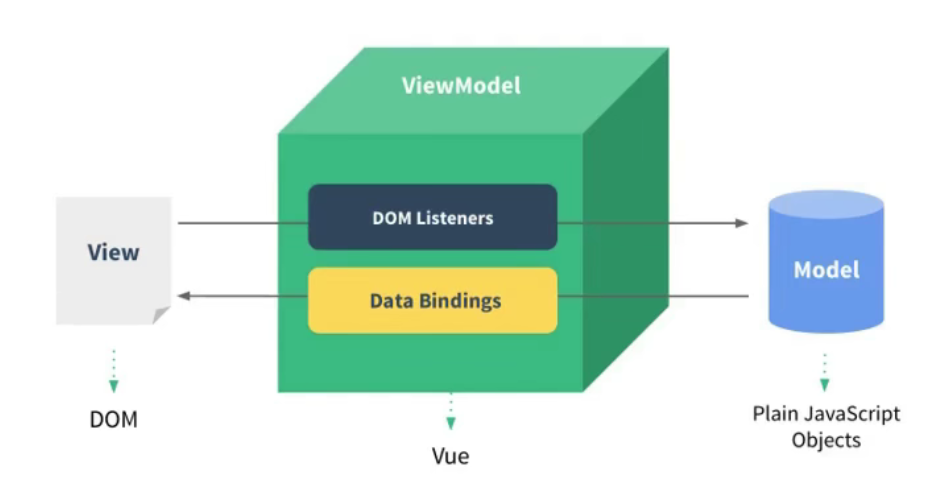

# Vue 核心

## 认识 Vue

### 什么是 Vue？

- 一套拥有构建用户界面的渐进式 （简单到复杂）JavaScript 框架。
- 简单应用：只需一个轻量小巧的核心库。
- 复杂应用：可以引入各式各样的 Vue 插件。

### Vue 的特点

1. 采用组件化模式，提高代码复用率、让代码更易于维护。
2. 声明式编码（对比命令式编码），无需直接操作 dom，提高开发效率。
3. 使用虚拟 dom + diff 算法，尽量复用 dom 节点。

### 创建 Vue 实例

1. 使用 vue 必须创建一个 vue 实例，并传入配置对象
2. root 容器里代码依然符合 html 规范，只是混入了 vue 语法
3. root 容器里的代码被称为 vue 模板
4. Vue 实例和容器是一一对应的

   1. 一个实例多个容器，只操作第一个；
   2. 多个实例一个容器，只有第一个实例起作用；

5. 真实开发中只有一个 vue 实例
6. `{{ expression }}` 双花括号里只能放 js 表达式（表达式即会产生一个值）
7. `data` 中数据有变化，将触发模板中对应的数据
8. 开发版 vue 会提示错误，生产版本 vue 不会， `Vue.config.productionTip = false` 可解决

## 模板语法（两大类）

- 插值语法
  - 解析标签体（开始标签和结束标签中间放的就是标签体）内容
  - 如语法 `{{ xxx }}`，`xxx` 为 js 表达式
- 指令语法（包含动作）
  - 解析标签属性、解析标签体内容、绑定事件
  - 如 `v-bind:href="xxx"`，`xxx` 为 js 表达式，可简写为 `:href="xxx"`

## 数据绑定（两种方式）

- 单向数据绑定 `v-bind`：数据单向流动，`data` 流向页面，简写 `:value`；
- 双向数据绑定 `v-model`：数据双向流动
  - 双向绑定一般应用在表单输入类元素
  - `v-model:value` 默认收集的是 `value` 值，可简写为 `v-model`

```html
单向数据绑定：<input type="text" :value="name" /><br />
双向数据绑定：<input type="text" v-model="name" /><br />
```

## el 和 data 的写法

el 的两种写法：

1. `new Vue` 里配置 `el` 属性
2. 先创建 Vue 实例，随后用 `vm.$mount()` 挂载根节点

data 的两种写法：

1. 对象式
2. 函数式：组件化时必须 data 必须使用函数式
3. 注意 **Vue 管理的函数不能用箭头函数，否则 this 的指向问题会出错**

## MVVM 模型

M：模型 Model，对应 `data` 中的数据

V：视图 View，模板

VM：视图模型 ViewModel，`Vue` 实例对象



发现了什么？

- data 中的所有属性，最后都出现在 vm 身上
- vm 实例上的所有属性以及 Vue 原型上的属性，都能在模板中直接使用

## 数据代理

### Object.defineProperty()

```js
Object.defineProperty(person, "age", {
    value: 18,
    enumerable: true, // 属性是否可枚举 默认false
    writable: true, // 属性是否可修改 默认false
    configurable: true, // 属性是否可删除 默认false
});
...
Object.defineProperty(person, "age", {
    // 当读取age属性时，getter函数会被调用，函数返回值是age的值
    get() {
        return number;
    },
    // 当有人修改age属性时，setter函数会被调用，返回值是所要修改的结果
    set(value) {
        number = value;
    },
});
```

### 什么是数据代理？

通过一个对象代理对另一个数据对象的属性操作（读/写）

```js
let obj = { x: 100 };
let obj2 = { y: 12 };
Object.defineProperty(obj2, "x", {
  get() {
    return obj.x;
  },
  set(value) {
    obj.x = value;
  },
});
```

### Vue 中的数据代理

- 通过 `vm` 对象来代理 `data` 对象中属性的操作（读/写）
- 优点：更方便操作 `data` 中的数据
- 原理：
  - `Object.defineProperty()` 把 `data` 对象中所有属性添加到 `vm` 上
  - 为 `vm` 上的每个属性指定 `getter/setter` 操作
  - 通过 `getter/setter` 去操作（读/写）`data` 中对应属性
  - `_data` 做数据劫持，监听数据变化，从而触发关联的组件重新渲染

## 事件处理

### 基本使用

- 使用 `v-on:xxx` 或 `@xxx` 绑定事件，`xxx` 是事件名
- 事件的回调函数配置在 `methods` 中，最终挂载到 `vm` 上
- `methods` 中配置的函数不可使用箭头函数，否则 `this` 就不会指向 `vm` 了
- `methods` 中配置的函数是被 `Vue` 管理的函数，`this` 指向 `vm` 或实例对象
- `@click="demo"` 和 `@click="demo(num, $event)"` 效果一样，前者默认传参 `event`，后者括号自定义传参

### 事件的修饰符

- `stop`：阻止事件冒泡（常用）

- `prevent`：阻止默认事件（常用）
- `once`：事件只触发一次（常用）
- `capture`：使用事件的捕获模式
- `self`：当 `event.target` 是当前 self 指定元素时才触发
- `passive`：事件默认行为立即执行，无需等待回调函数执行完成

```html
<!-- 事件捕获：默认先处理冒泡事件后捕获(info2->info) capture 即先捕获后冒泡(info->info2) -->
<div class="capture1" @click.capture="showInfo">
  div1
  <div class="capture2" @click="showInfo2">div2</div>
</div>

<!-- 修饰符可以连着写：先阻止事件冒泡，后阻止默认事件触发 -->
<div @click="showInfo">
  <a href="..." @click.stop.prevent>标签</a>
</div>
```

`scroll` 事件和 `wheel` 事件的区别：

- 两者都是监听页面滚动的事件
- `scroll` 事件在拖动滑块或鼠标滚轮滚动时都会被触发，`wheel` 事件仅在滚轮滚动时触发
- 拖动到底部继续滚动，`scroll` 事件不再触发，`wheel` 事件依然被触发
- `scroll` 事件无需等待回调函数执行完成，立即执行
- `wheel` 事件需等待回调函数执行完成后才响应，容易造成页面卡顿，可结合 `passive` 修饰符解决

### 键盘事件

常用按键名：

- 回车：`enter`
- 删除：`delete` （捕获删除和退格键）
- 退出：`esc`
- 空格：`space`
- 换行：`tab` （注意：配合 `keydown` 使用）
- 上：`up`
- 下：`down`
- 左：`left`
- 右：`right`

注意：

1. Vue 没有提供其他按键的别名，可以通过 `e.key` 获取，单词组合需转换为 `caps-lock` (短线小写命名)
2. 系统修饰键：`ctrl`、`alt`、`shift`、`meta(window)`，配合 `keydown` 才能正常触发
3. 也可使用 `keyCode` 指定具体按键，官方不推荐
4. 可通过 `Vue.config.keyCodes.自定义键名 = 键码` 指定按键名
5. 可以连写，如 `@keyup.ctrl.y` 表示同时按下 `crtl` 和 `y` 键触发

## 属性计算-computed

设计初衷是用于简单运算，在模板中放太多逻辑运算会导致模板过重且难以维护。

**是什么？**

需要的属性不存在，需通过已有的属性计算得到结果。

```js
computed: {
    fullName: {
        get() {
            console.log("get is called");
            return this.firstName + "-" + this.lastName;
        },
        set(value) {
            console.log("set is called");
            const arr = value.split("-");
            this.firstName = arr[0];
            this.lastName = arr[1];
        },
    },
    ...
    // 简写形式：只考虑读取，不考虑修改
    fullName() {
        return this.firstName + "-" + this.lastName;
    },
},
```

**为啥用它？**

使用函数回调的方法计算属性，如果多次使用将触发多次更新，对性能不友好。

`computed` 内部有缓存机制，对性能更加友好，调试方便。

**原理是啥？**

底层使用 `Object.defineProperty` 提供的 `setter` 和 `getter`。

**getter 什么时候执行？**

初次读取只执行一次，后续直接读取缓存。

当依赖的数据更新时将再次被调用。

**computed vs methods**

computed 基于响应式依赖进行缓存，只有依赖的数据发生变化才会重新计算求值

相比之下，methods 里的函数在每次重新渲染时都会被触发

**注意事项**

计算属性最终会放入 `vm` 中，直接读取使用即可，无需添加括号。

如果想修改计算属性，需通过 `setter` 函数去修改。`setter` 中要引起依赖的数据发生改变，才能出发视图更新。

## 监视属性-watch

### **是什么**

- 当监视的属性（必须存在）发生变化时，回调函数自动调用，并进行相关处理。

属性监视的两种写法

```js
// 1. vue实例内配置
new Vue {
    ...
    watch: {
        isHot: {
            immediate: true, // 初始化时是否调用一次handler 默认false
            handler(newVal, oldVal) {
                //监听回调函数
                ...
            }
        }
    }
}

// 2. vm.$watch 配置
const vm = new Vue({ ... })
vm.$watch("isHot", {
    immediate: true, // 初始化调用一次handler
    handler(newVal, oldVal) {
      ...
    },
});
```

### 深度监视

- Vue 中的 `watch` 默认使用浅对比监测对象内部属性的变化（一层）
- 设置配置项 `deep: true` 可深度对比监测对象内部属性的变化（多层级）
- 监测单个属性可通过 `"obj.xxx"`

```js
watch: {
    "number.b": {
        handler() {
            console.log("b is updated");
        },
    },
    number: {
        deep: true, // 监视对象所有属性的变化
        immediate: true, // 初始化就触发
        ...
    }
}
```

**注意事项**

- Vue 自身可以监测对象内部属性的改变，但 Vue 提供的 watch 默认不可以
- 使用 watch 监测对象时，根据数据结构决定是否采用深度监视

**简写形式**

当只需要用到 `handler` 函数，无需用到其他配置项，就能使用简写：

```js
watch {
    isHot(newVal, oldVal) {
        ...
    }
}
...
vm.$watch('isHot', function(newVal, oldVal) {
    ...
})
```

### computed vs watch

- `computed` 能实现的功能 `watch` 也能实现
- `watch` 能实现的功能 `computed` 不一定能，比如异步操作

**tips**

- 所有被 Vue 管理的函数，最好写成普通函数，这样 `this` 指向才是 `vm` 或组件实例对象
- 所有不被 Vue 管理的函数（setTimeout/setInterval/Promise...），应写成箭头函数。因为异步回调是浏览器引擎执行的，使用普通函数将指向 `Windows`，用箭头函数才能往外寻找到 vm 对应的实例对象。

## 绑定样式

### 绑定 class

```html
<!-- 字符串写法 -->
<div class="basic" :class="a" @click="changeMood">hello vue.</div>

<!-- 数组写法 -->
<div class="basic" :class="classArr">hello vue.</div>

<!-- 对象写法 -->
<div class="basic" :class="classObj">hello vue.</div>

... data: { classArr: ["bold", "sizeBigger", "underline"], classObj: { bold:
false, sizeBigger: false, underline: true, }, },
```

三种写法适用场景：

- 字符串写法：-样式类名不确定，需要动态指定
- 数组写法：绑定样式的个数不确定，名字不确定
- 对象写法：绑定样式的个数、名字确定，要动态决定是否展示

### 内联 style

```html
<!-- style内联写法 -->
<div class="basic" :style="{fontSize: fsize + 'px'}">style内联写法.</div>

<!-- style 对象写法 -->
<div class="basic" :style="styleObj1">style对象写法.</div>

<!-- style 数组写法 -->
<div class="basic" :style="[styleObj1, styleObj2]">style对象写法.</div>

... data { styleObj1: { color: "red", fontSize: "32px", }, }
```

## 条件渲染

`v-if`：判断结果为 `flase` 直接删除 dom 节点，适用于切换频率比较低的场景，影响性能。可以配合 `v-else-if` `v-else` 使用，提高效率。但前提是不被其他节点打断。

```html
<div v-if="n === 1">Angular</div>
<div v-if="n === 2">React</div>
<div v-if="n === 3">Vue</div>

<!-- 使用v-if和v-else-if做条件渲染 提高性能 避免重复计算-->
<div v-if="n === 1">Angular</div>
<div v-else-if="n === 2">React</div>
<div v-else-if="n === 3">Vue</div>
```

`v-show`：通过样式控制节点是否展示，适用于切换频率较高的场景。

```html
<div v-show="false">{{text}}.</div>
<div v-show="!isShow">{{text}}.</div>
```

`template`，不破坏原有 dom 结构，类似 React 中的 `Fragment`，可配合 `v-if` 使用，不能配合 `v-show`

```html
<template v-if="n === 1">
  <h2>list1</h2>
  <h2>list2</h2>
  <h2>list3</h2>
</template>
```

## 列表渲染

### v-for

1. 通常用于展示列表数据
2. 语法：`v-for="item in items :key="item.id"` 其中 `items` 是源数组，`item` 是数组元素的别名
3. 可遍历：数组、对象、字符串（用得少）、指定次数（用得少）

```html
<!-- 数组遍历 -->
<li v-for="(p, index) in persons" :key="p.id">{{p.name}}-{{p.age}}</li>

<!-- 遍历对象 -->
<li v-for="(value, k) in car" :key="k">{{k}}-{{value}}</li>

<!-- 遍历指定次数 -->
<li v-for="(number, index) of 5" :key="index">{{index}}-{{number}}</li>
```

### Vue 中的 Key

**虚拟 Dom 中 key 的作用**

key 是虚拟 DOM 对象的标识，当数据发生变化时，Vue 会根据新数据生成新的虚拟 DOM。然后将新虚拟 DOM 和旧虚拟 DOM 进行差异比较（diff 算法）。

**虚拟节点对比规则**

- 旧虚拟 DOM 中找到了与新虚拟 DOM 相同的 key
  - 若虚拟 DOM 中内容没变, 直接使用之前的真实 DOM（`input` 输入框对比不变，不更新，其实并没有对上）
  - 若虚拟 DOM 中内容变了, 则生成新的真实 DOM，随后替换掉页面中之前的真实 DOM（文本内容）
- 旧虚拟 DOM 没有找到和新虚拟 DOM 相同的 key
  - 创建新的 DOM 节点，随后渲染页面（用唯一表示作为 key）

```html
<li v-for="(p,index) of persons" :key="index">
  {{p.name}}-{{p.name}}
  <input type="text" />
</li>
```

**用 index 作为 key 可能引发的问题**

若对数据进行：逆序添加、逆序删除等破坏顺序操作，index 发生改变会产生没有必要的更新

如果 DOM 结构包含输入类节点，会产生错误的更新

**如何合理选择 key？**

- 最好使用每条数据的唯一标识作为 key, 比如 id、身份证等唯一值
- 如果不存在对数据的逆序添加、逆序删除等破坏顺序操作，仅用于展示，使用 index 作为 key 也是可以的

```html
<!-- 出现错误 key需取唯一值，即id -->
<ul>
  <li v-for="(p,index) of persons" :key="index">
    {{p.name}}-{{p.age}}
    <input type="text" />
  </li>
</ul>
<script>
  new Vue({
    el: "#root",
    data: {
      persons: [
        { id: "001", name: "张三", age: 18 },
        { id: "002", name: "李四", age: 19 },
        { id: "003", name: "王五", age: 20 },
      ],
    },
    methods: {
      add() {
        const p = { id: "004", name: "老刘", age: 40 };
        this.persons.unshift(p);
      },
    },
  });
</script>
```

### 列表排序

可用 `watch` 或 `computed` 实现

```js
// 使用 watch 监听 keyword，修改原数组
watch:{
    keyWord:{
        immediate:true,
        handler(val){
          this.filPerons = this.persons.filter((p)=>{
              return p.name.indexOf(val) !== -1
          })
        }
    }
}

// 使用 computed 不修改原数组，直接返回结果，更加简洁
new Vue({
    el:'#root',
    data:{
        keyWord:'',
        persons:[
            {id:'001',name:'马冬梅',age:19,sex:'女'},
            {id:'002',name:'周冬雨',age:20,sex:'女'},
            {id:'003',name:'周杰伦',age:21,sex:'男'},
            {id:'004',name:'温兆伦',age:22,sex:'男'}
        ]
    },
    computed:{
        filPerons(){
            return this.persons.filter((p)=>{
                return p.name.indexOf(this.keyWord) !== -1
            })
        }
    }
})
```

### 列表过滤

使用 `computed` 不直接修改原数组

```js
computed: {
    filPerons(){
        const arr = this.persons.filter((p)=>{
            return p.name.indexOf(this.keyWord) !== -1
        })
        //判断一下是否需要排序 0原序 1升序 2降序
        if(this.sortType){
            arr.sort((p1,p2)=>{
                return this.sortType === 1 ? p2.age-p1.age : p1.age-p2.age
            })
        }
        return arr
    }
}
```

### 模拟 Vue 中的数据监测

```js
let data = {
  name: "ming",
  address: "xiamen",
};

// 陷入死循环
// Object.defineProperty(data, "name", {
//   get() {
//     return data.name;
//   },
//   set(value) {
//     data.name = value;
//   },
// });

// 创建一个监视的实例对象，用于监视data中属性的变化
const obs = new Observer(data);
//准备一个vm实例对象
let vm = {};
vm._data = data = obs;
function Observer(obj) {
  //汇总对象中所有的属性形成一个数组
  const keys = Object.keys(obj);
  //遍历
  keys.forEach((k) => {
    Object.defineProperty(this, k, {
      get() {
        return obj[k];
      },
      set(val) {
        console.log(`${k}被改了，我要去解析模板，生成虚拟DOM.....我要开始忙了`);
        obj[k] = val;
      },
    });
  });
}
```

### Vue 监视数据原理

1. vue 会监视 data 中所有层次的数据。
2. 监测对象中的数据是通过 `setter` 实现监视，且要在 new Vue 时就传入要监测的数据
   1. 向对象添加的属性，Vue 默认不做响应式处理
   2. 如果需给添加对象的属性做响应式，可通过：`Vue.set(target，propertyName/index，value)` 或 `vm.$set(...)`
   3. 为已有对象添加多个属性可通过：`Object.assign({}, this.Object, {...})`
3. 如何监测数组中的数据：通过重写数组更新元素的方法，本质就是做了两件事：
   1. 调用原生对应的方法对数组进行更新
   2. 重新解析模板，触发更新
4. Vue 中修改数组某个元素必须使用如下方法：
   1. push()、pop()、shift()、unshift()、splice()、sort()、reverse()
   2. Vue.set() 或 vm.$set()

**注意：`Vue.set()` 和 `vm.$set()` 不能给 vm 或 vm 的根数据对象(vm.data)添加属性**

## 表单提交

### 输入框的不同类型

1. `<input type="text"/>`，`v-model` 收集的是 value 值，用户输入的就是 value 值；
2. `<input type="radio"/>`，`v-model` 收集的是 value 值，且要给标签配置 value 值。
3. `<input type="checkbox"/>`：

- 没有配置 value 属性，则收集的是 checked（勾选 or 未勾选，是布尔值）
- 配置 value 属性:
- `v-model` 的初始值是非数组，则收集的是 checked（勾选 or 未勾选，是布尔值）
- `v-model` 的初始值是数组，则收集的的是 value 组成的数组

4.  `v-model` 的三个修饰符

- lazy：失去焦点再收集数据，避免多次出发更新

- number：输入字符串转为有效的数字

- trim：清除输入的首尾空格

```html
<form @submit.prevent="getSubmit">
  账号：<input type="text" v-model.trim="userInfo.account" /> <br /><br />
  密码：<input type="password" v-model="userInfo.password" /> <br /><br />
  年龄：<input type="number" v-model.number="userInfo.age" /> <br /><br />
  性别： 男<input type="radio" name="sex" v-model="userInfo.sex" value="male" />
  女<input type="radio" name="sex" v-model="userInfo.sex" value="female" />
  <br /><br />
  爱好： 学习<input type="checkbox" v-model="userInfo.hobby" value="study" />
  打游戏<input type="checkbox" v-model="userInfo.hobby" value="game" />
  吃饭<input type="checkbox" v-model="userInfo.hobby" value="eat" />
  <br /><br />
  所属校区
  <select v-model="userInfo.city">
    <option value="">请选择校区</option>
    <option value="beijing">北京</option>
    <option value="shanghai">上海</option>
    <option value="shenzhen">深圳</option>
    <option value="wuhan">武汉</option>
  </select>
  <br /><br />
  其他信息：
  <textarea v-model.lazy="userInfo.other"></textarea> <br /><br />
  <input type="checkbox" v-model="userInfo.agree" />阅读并接受<a href="..."
    >《用户协议》</a
  >
  <button>提交</button>
</form>
```

```js
new Vue({
  el: "#root",
  data: {
    userInfo: {
      account: "",
      password: "",
      age: 18,
      sex: "female",
      hobby: [], // 初始值为数组 则收集的是 value 组成的数组
      city: "beijing",
      other: "",
      agree: "",
    },
  },
  methods: {
    getSubmit() {
      console.log(JSON.stringify(this.userInfo));
    },
  },
});
```

## 过滤器

**什么是过滤器？**

对要展示的数据进行一些特定的处理后再渲染，比较适用于一些简单的逻辑处理、格式化。

**语法**

全局注册：`Vue.filter(name, callback)`

局部注册： `new Vue({filters: {...}})`

在 vue 中使用：`{{ xxx | filterName }}` 或 `v-bind="xxx | filterName"`

**注意：**

1. 过滤器也可以接收额外参数、多个过滤器也可以串联

2. 过滤器没有改变数据本身，而是返回新的对应的数据

```html
<!-- 过滤器实现 -->
<h3>现在是：{{time | timeFormater}}</h3>
<!-- 过滤器实现（传参） -->
<h3>现在是：{{time | timeFormater('YYYY_MM_DD') | mySlice}}</h3>
<h3 :x="msg | mySlice">filters</h3>
```

```js
// 全局过滤器
Vue.filter("mySlice", function (value) {
  return value.slice(0, 4);
});
new Vue({
  el: "#root",
  data: {
    time: 1621561377603, //时间戳
    msg: "你好，明",
  },
  // 局部过滤器
  filters: {
    timeFormater(value, str = "YYYY年MM月DD日 HH:mm:ss") {
      // console.log('@',value)
      return dayjs(value).format(str);
    },
  },
});
```

## 内置指令

### v-text

- 向其所在的 dom 节点渲染文本内容
- 与插值语法的区别：`v-test` 会替换节点中的内容， `{{xx}}` 不会

```html
<div v-text="name"></div>
```

### v-html

作用：向指定节点中渲染包含 html 结构的内容

与插值语法的区别：

- `v-html` 会替换节点内所有内容，插值语法不会
- `v-html` 可识别 html 结构

注意：

- 在网站上动态渲染任意 HTML 是非常危险的，容易导致 XSS 攻击
- 必须在可信的内容上使用 `v-html`，不要在用户提交的内容上使用

### v-cloak

本质是一个特殊属性，Vue 实例创建完毕并接管容器后，会删掉 `v-cloak` 属性。

可使用 css 配合 `v-cloak` 解决网速慢时页面展示出 {{xxx}} 的问题。

```html
<style>
  [v-cloak] {
    display: none;
  }
</style>
<div id="root">
  <h2 v-cloak>{{name}}</h2>
</div>
```

### v-once

`v-once` 所在节点在初次渲染之后，就被视为静态内容。后续数据改变引起的更新也不会引起 `v-once` 所在结构的更新，用于优化性能。

```html
<h2 v-once>初始化的n值是:{{n}}</h2>
<h2>当前的n值是:{{n}}</h2>
<button @click="n++">点我n+1</button>
```

### v-pre

作用：跳过所在节点的编译过程，可通过它跳过没有使用插值语法、指令语法等的节点，加快编译，提高效率

```html
<h2 v-pre>这里会被跳过</h2>
```

## 自定义指令

**语法**

```js
// 局部指令
new Vue({
    directives: {
        xxx: Object/callback
    }
})

// 全局指令
Vue.directive(xxx: Object/callback)
```

**指令配置对象的三个回调**

```js
new Vue({
  directives: {
    xxx: {
      // 指令与元素成功绑定时（初始化）
      bind(element, binding) {
        element.value = binding.value;
      },
      // 指令所在元素被插入页面时
      inserted(element, binding) {
        element.focus();
      },
      // 指令所在的模板被重新解析时(更新)
      update(element, binding) {
        element.value = binding.value;
      },
    },
  },
});
```

**注意事项**

1. 指令定义时不加 v-，但使用时要加 v-

2. 指令名如果是多个单词，要使用 kebab-case 命名形式，不要用 camelCase(驼峰式) 命名

## 生命周期


**常用的生命周期钩子**

- mounted：发送 `ajax` 请求、启动定时器、绑定自定义事件、订阅消息等「初始化操作」
- beforeDestroy：清除定时器、解绑自定义事件、取消订阅消息等「收尾工作」

**Vue 实例的销毁**

- 销毁后在开发者工具 vue 看不到任何信息
- 销毁后自定义事件会失效，但原生 DOM(如点击) 事件依然有效
- 一般不在 `beforeDestroy` 操作数据，因为即便操作数据，也不会再触发更新流程

# 组件化

## 模块化与组件化

**模块化**

模块：向外提供特定功能的 js 程序或集合，通常是一个 js 文件。以模块导出就是模块化。

作用：复用 js，提高效率

**组件化**

组件：现实应用中局部功能代码和资源的集合。多组件方式编写，实现多组件应用。

组件分为单文件和非单文件

## 组件编写

**组件定义**

组件：现实应用中局部功能代码和资源的集合

非单文件组件：单个文件包含 n 组件，所以样式尽量不跟着组件走，容易混乱

单文件组件：一个文件中只有 1 个组件

**组件使用的 3 个步骤**

1. 定义组件（创建组件）
2. 注册组件
3. 使用组件（组件标签）

**1.定义组件**

使用 `Vue.extend(options)` 创建

注意事项

1. el 不要写 —— 最终所有的组件都要归于 vm 管理，vm 的 el 决定使用哪个容器

2. data 必须写成函数 —— 避免组件被复用时，数据存在引用关系

3. 可使用 template 配置组件结构

```js
const school = Vue.extend({
  template: `
				<div class="demo">
					...
				</div>
			`,
  data() {},
  methods: {},
});
```

**2.注册组件**

```js
// 局部注册
new Vue({
  components: {
    hello: A,
  },
});

// 全局注册
Vue.component("hello", A);
```

**组件名写法**

- 一个单词组成：
  - 写法 1 (首字母小写)：school
  - 写法 2 (首字母大写)：School
- 多个单词组成：
  - 写法 1 (kebab-case 命名)：my-school
  - 写法 2 (CamelCase 命名)：MySchool (需要 Vue 脚手架支持)

**组件标签**

写法 1：`<school></school>`

写法 2：`<school/>` 需脚手架支持

**简写**

`const school = Vue.extend(options)` 可简写为 `const school = options`

```js
//定义组件
const s = {
    // 定义组件名称
    name: "atguigu",
    template: `...`,
    data() {...},
};

new Vue({
    el: "#root",
    data: {...},
    components: {
        school: s,
    },
});
```

**组件嵌套**

```js
// 定义student组件
const student = Vue.extend({
  template: `...`,
  data() {},
});

// 定义school组件
const school = Vue.extend({
  name: "school",
  template: `...`,
  data() {},
  components: {
    student,
  },
});

//定义app组件
const app = Vue.extend({
  template: `
				<div>	
					<hello></hello>
					<school></school>
				</div>
			`,
  components: {
    school,
    hello,
  },
});

new Vue({
  template: "<app></app>",
  el: "#root",
  components: { app },
});
```

## **VueComponent**

- 组件本质上是一个名为 VueComponent 的构造函数，通过 `Vue.extend` 生成的
- 我们只需编写 `<school></school>`，Vue 解析时会帮我们创建组件的实例对象，即执行 `new VueComponent(options)`
- 每次调用 `Vue.extend`，返回的是一个全新的 VueComponent
- 关于 this 指向：
  - 组件配置中 data 函数、methods、watch、computed 的函数的 `this` 为 VueComponent 实例对象
  - new Vue(options) 配置中的函数的 `this` 为 `vm` 实例对象
- VueComponent 的实例简称 vc；Vue 的实例简称 vm

**一个重要的内置关系**

- `VueComponent.prototype.__proto__ === Vue.prototype`

- 原因：让组件实例对象（vc）可以访问到 Vue 原型上的属性、方法

# Vue-Cli

## Cli 核心

### 不同版本的 Vue

Q：为啥在 `main.js` 用 `components` 写法注册组件会失败？

A：脚手架引入的 vue 是`vue.runtime.xxx.js`，没有模板解析器。

- vue.js 与 vue.runtime.xxx.js 区别
  - vue.js 是完整版的 Vue，包含：核心功能 + 模板解析器。
  - vue.runtime.xxx.js 是运行版的 Vue，只包含：核心功能；没有模板解析器。
- 原因：vue.runtime.xxx.js 没有模板解析器，是为了减少打包体积。
- 所以不能使用 template 这个配置项，需要使用 render 接收 createElement 函数去指定渲染内容。

```js
// h: CreateElement(tag?: string | Component)
new Vue({
  render: (h) => h("h2", "hello vue"),
}).$mount("#app");
```

### vue.config.js 配置文件

1. 使用 `vue inspect > output.js` 可以查看到 Vue 脚手架的默认配置。
2. 创建 vue.config.js 文件可对脚手架进行个性化定制，详情见：https://cli.vuejs.org/zh

### ref 属性

1. 用来获取元素或子组件的引用信息
2. 应用在 html 标签上获取的是真实 DOM 元素，应用在组件标签上是组件实例对象（vc）
3. 使用方式：
   1. 打标识：`<h1 ref="xxx">.....</h1>` 或 `<School ref="xxx"></School>`
   2. 获取：`this.$refs.xxx`

### props 配置项

1. 功能：让组件接收外部传过来的数据

2. 传递数据：`<Demo name="xxx"/>`

3. 接收数据方式：

   1. 第一种方式（只接收）：`props:['name']`

   2. 第二种方式（限制类型）：`props:{ name:String }`

   3. 第三种方式（限制类型、限制必要性、指定默认值）：

      ```js
      props:{
      	name:{
              type:String, //类型
              required:true, //必要性
              default:'老王' //默认值
      	}
      }
      ```

   > 备注：props 是只读的，Vue 底层会监测你对 props 的修改，如果进行了修改，就会发出警告。若业务需求确实需要修改，那么请复制 props 的内容到 data 中一份，然后去修改 data 中的数据。

父组件传值时要注意用 v-bind 绑定的是表达式，否则一律当作字符串处理。

### mixin 混入

是什么？将多个组件公用的配置提取成一个混入对象，提高代码复用率

怎么用？

```js
// 1.定义混合
{
    data(){....},
    methods:{....}
    ....
}
// 全局使用
Vue.mixin(xxx)
// 局部使用
mixins:['xxx', 'yyy']
```

### install 插件

功能：增强 Vue

本质上是一个包含 `install ` 方法的对象。`install` 第 1 个参数是 Vue，第 2 个以后的参数是用户传递的数据。

定义插件：

```js
对象.install = function (Vue, options) {
    // 1. 添加全局过滤器
    Vue.filter(....)

    // 2. 添加全局指令
    Vue.directive(....)

    // 3. 配置全局混入(合)
    Vue.mixin(....)

    // 4. 添加实例方法
    Vue.prototype.$myMethod = function () {...}
    Vue.prototype.funcName = xxxx
}
```

使用插件：`Vue.use()`

### scoped 样式

1. 作用：让样式在局部生效，防止命名冲突
2. 写法：`<style scoped>`

### TodoList 实例总结

组件化编码流程：

- 拆分静态组件：按功能点拆分，命名不能与 html 元素冲突
- 实现动态组件：考虑好数据的存放位置，数据是一个还是多个组件在用？

  - 一个组件在用：放在组件自身即可
  - 多个组件在用：放在他们共同的父组件上（状态提升）

- 实现交互：从绑定事件开始

props 适用于：

- 父组件向子组件通信传值
- 子组件父组件通信（通过父给子传递函数）

使用 `v-model` 切记：`v-model` 绑定的值不能是 `props` 的值，因为 `props` 不可修改

`props` 传过来的若是对象类型，修改对象中的属性时 Vue 不报错，但不推荐这样做

### 自定义事件

本质上是组件间通信的方式，适用于**子向父传值**

自定义事件使用

```html
<!-- 自定义事件绑定 -->
<Demo @onEvent="test" />
<Demo v-on:onEvent="test" />
<!-- 使用 ref 调用 -->
<Demo ref="demo" />
<script>
  mounted(){
      this.$refs.xxx.$on('eventname',this.func)
  }
</script>

<!-- 只触发一次 -->
<Demo ref="demo" once />
<script>
      mounted(){
          this.$refs.demo.$once('eventname', this.func)
      }


  // 子组件触发自定义事件
  this.$emit('eventname', params)

  // 解绑自定义事件
  this.$off('eventname') // 解绑一个自定义事件
  this.$off(['eventname1','eventname2']) // 解绑多个自定义事件
  this.$off() // 解绑所有的自定义事件
</script>
```

组件上也可以绑定原生 DOM 事件，需要使用 `native` 修饰符

```html
<Student ref="student" @click.native="show" />
```

注意：通过 `this.$refs.xxx.$on('atguigu',callback)` 绑定自定义事件时，回调要么配置在 methods 中，要么用箭头函数，否则 this 指向会出问题

### 全局事件总线

一种组件间通信的方式，适用于任意组件间通信

安装全局事件总线：

```js
new Vue({
  // ...
  beforeCreate() {
    Vue.prototype.$bus = this; //安装全局事件总线，$bus就是当前应用的vm
  },
  // ...
});
```

使用事件总线：

接收数据：组件 A 要的数据，则在组件 A 中给 $bus 绑定自定义事件，事件回调留在 A 组件自身。

```js
methods() {
  demo(data){......}
}
......
mounted() {
  this.$bus.$on('xxxx',this.demo)
}
```

- 提供数据：`this.$bus.$emit('xxxx',数据)`

- 最好在 `beforeDestroy` 钩子中，用 `$off` 去解绑当前组件所用到的事件。而自定义事件不需要解绑，因为它会随着组件的销毁而去除。

### nextTick

作用：在下一次 DOM 更新结束后执行其指定的回调。

使用场景：当改变数据后，要基于更新后的新 DOM 进行操作时，可在 `nextTick` 所指定的回调函数中执行。

```js
this.$nextTick(function () {
  this.$refs.inputRef.focus();
});
```

### Vue 封装的过渡和动画

作用：在插入、更新或移除 DOM 元素时，在合适的时机给元素添加样式类名

API：使用 `<transition>` 包裹要过度的元素，并配置 `name ` 属性。如果没有名字，则 `v-` 是类名默认前缀

- 元素进入的样式
  1. v-enter：进入的起点
  2. v-enter-active：进入过程中
  3. v-enter-to：进入的终点
- 元素离开的样式
  1. v-leave：离开的起点
  2. v-leave-active：离开过程中
  3. v-leave-to：离开的终点

```vue
<transition name="hello">
	<h1 v-show="isShow">你好啊！</h1>
</transition>
```

备注：若有多个元素需要过度，则需要使用：`<transition-group>`，且每个元素都要指定 `key` 值。

### 脚手架代理配置

**方法一**

```js
// vue.config.js
devServer: {
  proxy: "http://localhost:5000";
}
```

> 说明：
>
> 1. 优点：配置简单，请求资源时直接发给前端（8080）即可
> 2. 缺点：不能配置多个代理，请求控制不灵活
> 3. 注意：上述配置代理优先匹配本地服务器资源，如果请求的资源不存在时，请求才会转发给服务器

**方法二**

```js
// vue.config.js
module.exports = {
  devServer: {
    proxy: {
      "/api1": {
        // 匹配所有以 '/api1'开头的请求路径
        target: "http://localhost:5000", // 代理目标的基础路径
        ws: true, // websocket 是否开启，默认 true
        changeOrigin: true,
        pathRewrite: { "^/api1": "" },
      },
      "/api2": {
        // 匹配所有以 '/api2'开头的请求路径
        target: "http://localhost:5001", // 代理目标的基础路径
        changeOrigin: true,
        pathRewrite: { "^/api2": "" },
      },
    },
  },
};
/*
   changeOrigin 设置为 true，服务器收到的请求头中的 host 为：localhost:5000（骗子）
   changeOrigin 设置为 false，服务器收到的请求头中的 host 为：localhost:8080（真实）
   changeOrigin 默认值为 true
*/
```

> 说明：
>
> 1. 优点：可以配置多个代理，可灵活的控制请求是否走代理
> 2. 缺点：配置略微繁琐，请求资源时必须加前缀

### 插槽

作用：一种组件间通信的方式，父组件可以向子组件指定位置插入 html 结构，适用于父组件 => 子组件

三种方式：默认插槽、具名插槽、作用域插槽

默认插槽：简单的方式

```html
<!-- 父组件 -->
<Category>
  <div>html结构1</div>
</Category>
<!-- 子组件中 -->
<template>
  <div>
    <!-- 定义插槽 -->
    <slot>插槽默认内容...</slot>
  </div>
</template>
```

具名插槽：指定插槽名称，根据插槽名称渲染组件

```html
<!-- 父组件 -->
<Category>
  <template slot="top">
    <div>html结构1</div>
  </template>
  <!-- 此编写方式需配合template使用 -->
  <template v-slot:footer>
    <div>html结构2</div>
  </template>
</Category>
<!-- 子组件 -->：
<template>
  <div>
    <!-- 定义插槽 -->
    <slot name="center"
      >插槽默认内容(当使用者没有传递具体结构时，我会出现)</slot
    >
    <slot name="footer"
      >插槽默认内容(当使用者没有传递具体结构时，我会出现)</slot
    >
  </div>
</template>
```

作用域插槽：数据在组件的自身，但根据数据生成的结构需要组件的使用者（父组件）决定。（插槽组件向使用者传递数据）

```html
<!-- 父组件1 -->
<Category>
  <!-- scope需配合template使用 -->
  <template scope="scopeData">
    <!-- 生成ul -->
    <ul>
      <li v-for="g in scopeData.games" :key="g">{{g}}</li>
    </ul>
  </template>
</Category>
<!-- 父组件2 -->
<Category>
  <template slot-scope="scopeData">
    <!-- 生成的是h4 -->
    <h4 v-for="g in scopeData.games" :key="g">{{g}}</h4>
  </template>
</Category>

<!-- 子组件 -->
<template>
  <div>
    <slot :games="games"></slot>
  </div>
</template>

<script>
  export default {
    name: "Category",
    props: ["title"],
    //数据在子组件自身
    data() {
      return {
        games: ["红色警戒", "穿越火线", "劲舞团", "超级玛丽"],
      };
    },
  };
</script>
```

## Vuex

### 概念

在 Vue 中实现集中式（对应分布式）状态（数据）管理的一个 Vue 插件。对 Vue 应用中多个组件的共享状态进行集中式的管理（读/写），也是一种组件间通信的方式，且适用于任意组件间通信。

使用场景：当多个组件需要共享状态时。


- State：单一状态树，用一个对象包含了 Vue 全部应用的状态
- Getter：类似计算属性，返回 state 处理计算后的结果，不改变 state，当依赖值改变才会重新计算
- Actions：提交 mutation，不直接改变状态，可以包含异步操作
- Mutations：store 中改变状态的唯一方法，如果明确改变 state 的值，那么可直接调用，无需经过 Actions

### 基本使用

```js
//1. 创建 src/store/index.js
import Vue from "vue";
import Vuex from "vuex";
Vue.use(Vuex); //应用Vuex插件

const actions = {
  plus(context, value) {
    context.commit("PLUS", value);
  },
};
const mutations = {
  PLUS(state, value) {
    state.sum += value;
  },
};
// 当state中的数据需要经过加工后再使用时，可以使用getters加工
const getters = {
  bigSum(state) {
    return state.sum * 10;
  },
};
const state = {
  sum: 0,
};

//创建并暴露 store
export default new Vuex.Store({
  actions,
  mutations,
  state,
});

//2. 在main.js引入
import store from "./store";
new Vue({
  el: "#app",
  render: (h) => h(App),
  store,
});
```

### store 数据读取

组件中读取 vuex 的数据：`$store.state.sum`、`$store.getters.bigSum`

组件中修改 vuex 的数据：`$store.dispatch('action-name', value)` 或 `$store.commit('mutations-name',value)`

> 备注：若没有网络请求或其他业务逻辑，组件中也可以越过 actions，即不写`dispatch`，直接编写`commit`

### Vuex 的 map 方法

**mapState**：映射 `state` 中的数据作为计算属性

```js
computed: {
    // 对象写法
     ...mapState({getSum:'sum',getSchool:'school'}),

    // 数组写法
    ...mapState(['sum','school']),
},
```

**mapGetters**：映射 `getters` 中的数据作为计算属性

```js
computed: {
    // 对象写法
    ...mapGetters({toBig:'bigSum'}),

    // 数组写法
    ...mapGetters(['bigSum'])
},
```

**mapActions**：生成与 `actions` 对应的方法，即：`$store.dispatch(xxx)` 的函数

```js
methods:{
    // 对象形式
    ...mapActions({incrementOdd:'jiaOdd',incrementWait:'jiaWait'})

    // 数组形式
    ...mapActions(['jiaOdd','jiaWait'])
}
```

**mapMutations**：生成与 `mutations ` 对应的方法，即：`$store.commit(xxx)`的函数

```js
methods:{
    // 对象形式
    ...mapMutations({increment:'JIA',decrement:'JIAN'}),

    // 对象形式
    ...mapMutations(['JIA','JIAN']),
}
```

> 备注：mapActions 与 mapMutations 使用时，若需要传递参数需要：在模板中绑定事件时传递好参数，否则参数是事件对象。

### Vuex 模块化

目的：让代码更好维护，让多种数据分类更加明确。

```js
// store/index.js
const count = {
  namespaced: true, //开启命名空间
  state: { x: 1 },
  mutations: {},
  actions: {},
  getters: {
    bigSum(state) {
      return state.sum * 10;
    },
  },
};
const user = {
  namespaced: true, //开启命名空间
  state: {},
  mutations: {},
  actions: {},
};
const store = new Vuex.Store({
  modules: {
    count,
    user,
  },
});
```

开启命名空间后，读取 state

```js
// 方式一：this读取
this.$store.state.user.list
// 方式二：mapState
...mapState('user',['sum','school','subject']),`
```

开启命名空间后，读取 getters

```js
// 方式一：this读取
this.$store.getters['person/firstPersonName']
// 方式二：mapGetters
...mapGetters('person',['bigSum'])
```

开启命名空间后，调用 dispatch

```js
// 方式一：this
this.$store.dispatch('person/addPersonWang', value)
// 方式二：mapActions：
...mapActions('person',{incrementOdd:'jiaOdd',incrementWait:'jiaWait'})
```

开启命名空间后，调用 commit

```js
// 方式一：this
this.$store.commit('person/ADD_PERSON', value)
// 方式二：mapMutations：
...mapMutations('person',{ increment:'JIA',decrement:'JIAN' }),
```

## Vue-Router

> 单页面/多页面应用
>
> 路由切换组件哪去了？销毁了
>
> $route、$router 一样吗？window 挂载比较

理解： 一个路由（route）就是一组映射关系（key - value），key 是路径，value 是组件。多个路由需要路由器（router）进行管理。

### 基本使用

router.js 配置

```js
// 安装vue-router，命令：npm i vue-router
// 引入
import VueRouter from "vue-router";
import About from "../components/About";
import Home from "../components/Home";
// 创建router实例对象，去管理一个个路由规则
const router = new VueRouter({
  routes: [
    {
      path: "/about",
      component: About,
    },
    {
      path: "/home",
      component: Home,
    },
  ],
});
export default router;
```

active-class 配置当前路由激活样式

```html
<router-link active-class="active" to="/about">About</router-link>
```

路由对应组件展示

```html
<router-view></router-view>
```

### 几个注意点

1. 路由组件通常存放在 `pages` 文件夹，一般组件通常存放在 `components` 文件夹
2. 通过路由切换，组件被「隐藏了」。实际上是被销毁了，需要的时候再去挂载
3. 每个路由组件都有自己的 `$route` 属性，存储当前组件的路由信息
4. 整个应用只有一个 `$router`，通过 `this.$router` 获取，通常用于组件跳转

### 多级路由

```js
// router.js
routes:[{
        path:'/about',
        component:About,
    },{
        path:'/home',
        component:Home,
        children:[ //通过children配置子级路由
            {
                path:'news', //此处一定不要写：/news
                component:News
            },
            {
                path:'message',//此处一定不要写：/message
                component:Message
            }
        ]
    }]

// 跳转要写完整路径
<router-link to="/home/news">News</router-link>
```

### 路由参数

#### query

传递参数的几种方式

```vue
<!-- 跳转并携带 query 参数，to 的字符串写法 -->
<router-link :to="/home/message/detail?id=666&title=你好">跳转</router-link>

<!-- 跳转并携带query参数，to 的对象写法 -->
<router-link
  :to="{
    path: '/home/message/detail',
    query: {
      id: 666,
      title: '你好',
    },
  }"
>跳转</router-link>
```

接受参数

```js
$route.query.id;
$route.query.title;
```

#### param

声明接收 params 参数

```js
{
	path:'/home',
	component:Home,
	children:[{
			path:'news',
			component:News
		},
		{
			component:Message,
			children:[
				{
					name:'xiangqing',
					path:'detail/:id/:title', // 使用占位符声明接收params参数
					component:Detail
				}
			]
		}]
}
```

传递参数

```vue
<!-- 跳转并携带params参数，to的字符串写法 -->
<router-link :to="/home/message/detail/666/你好">跳转</router-link>

<!-- 跳转并携带params参数，to的对象写法 -->
<router-link
  :to="{
    name: 'xiangqing',
    params: {
      id: 666,
      title: '你好',
    },
  }"
>跳转</router-link>
```

> 注意：携带 params 参数时，若使用 to 的对象写法，则不能使用 path 配置项，必须使用 name 配置

接收参数

```js
$route.params.id;
$route.params.title;
```

### 命名路由

作用：简化路由跳转

```js
{
	path:'/demo',
	component: Demo,
	children:[
		{
			path:'test',
			component: Test,
			children:[
				{
                    name:'hello' // 给路由命名
					path:'welcome',
					component: Hello,
				}
			]
		}
	]
}
```

如何简化跳转

```html
<!--简化前，需要写完整的路径 -->
<router-link to="/demo/test/welcome">跳转</router-link>

<!--简化后，直接通过名字跳转 -->
<router-link :to="{name:'hello'}">跳转</router-link>

<!--配合传递参数 -->
<router-link
  :to="{
		name:'hello',
		query:{
		   id:666,
            title:'你好'
		}
	}"
  >跳转</router-link
>
```

### 路由 props

作用：让路由组件更方便的收到参数

```js
{
	name:'xiangqing',
	path:'detail/:id',
	component:Detail,

	// 第一种写法：props值为对象，对象中所有的key-value最终都会通过props传给Detail组件
	// props:{a:900}

	// 第二种写法：props值为布尔值，为true则把路由收到的所有params参数通过props传给Detail组件
	// props:true

	// 第三种写法：props值为函数，该函数返回的对象中每一组key-value都会通过props传给Detail组件
	props(route){
		return {
			id:route.query.id,
			title:route.query.title
		}
	}
}
```

### replace 属性

作用：控制路由跳转时操作浏览器历史记录的模式

浏览器的历史记录有两种写入方式：`push` 和 `replace`，`push` 是追加历史记录，`replace`是替换当前记录。路由跳转时候默认为 `push`

开启 `replace` 模式： `<router-link replace .......>News</router-link>`

### 编程式路由导航

作用：不借助 `<router-link> ` 实现路由跳转，让路由跳转更加灵活

```js
//$router的两个API
this.$router.push({
  name: "xiangqing",
  params: {
    id: xxx,
    title: xxx,
  },
});

this.$router.replace({
  name: "xiangqing",
  params: {
    id: xxx,
    title: xxx,
  },
});
this.$router.forward(); //前进
this.$router.back(); //后退
this.$router.go(); //可前进也可后退
```

### 缓存路由组件

作用：让不展示的路由组件保持挂载，不被销毁。

```vue
<keep-alive include="News"> 
    <router-view></router-view>
</keep-alive>
```

### 两个新的生命周期钩子

作用：路由组件所独有的两个钩子，用于捕获路由组件的激活状态。

具体名字：

- `activated` 路由组件被激活时触发。
- `deactivated` 路由组件失活时触发。

### 路由守卫

作用：对路由进行权限控制

分类：全局守卫、独享守卫、组件内守卫

#### 全局守卫

```js
// 全局前置守卫：初始化时执行、每次路由切换前执行
router.beforeEach((to, from, next) => {
  console.log("beforeEach", to, from);
  if (to.meta.isAuth) {
    // 判断当前路由是否需要进行权限控制
    if (localStorage.getItem("school") === "atguigu") {
      // 权限控制的具体规则
      next(); // 放行
    } else {
      alert("暂无权限查看");
      // next({name:'guanyu'})
    }
  } else {
    next(); // 放行
  }
});

// 全局后置守卫：初始化时执行、每次路由切换后执行
router.afterEach((to, from) => {
  console.log("afterEach", to, from);
  if (to.meta.title) {
    document.title = to.meta.title; // 修改网页的title
  } else {
    document.title = "vue_test";
  }
});
```

#### 独享守卫

```js
beforeEnter(to,from,next){
	console.log('beforeEnter',to,from)
	if(to.meta.isAuth){ //判断当前路由是否需要进行权限控制
		if(localStorage.getItem('school') === 'atguigu'){
			next()
		}else{
			alert('暂无权限查看')
			// next({name:'guanyu'})
		}
	}else{
		next()
	}
}
```

#### 组件内守卫

```js
//进入守卫：通过路由规则，进入该组件时被调用
beforeRouteEnter (to, from, next) {
},
//离开守卫：通过路由规则，离开该组件时被调用
beforeRouteLeave (to, from, next) {
}
```

### 路由器的两种工作模式

对于一个 url 来说，什么是 hash 值？—— `#` 及其后面的内容就是 hash 值

hash 值不会包含在 HTTP 请求中，即：hash 值不会带给服务器。

hash 模式：

- 地址中永远带着#号，不美观 ，但兼容性较好。
- 若以后将地址通过第三方手机 app 分享，若 app 校验严格地址会被标记为不合法。

history 模式：

- 地址干净美观，兼容性和 hash 模式相比略差。
- 应用部署上线时需要后端人员支持，解决刷新页面服务端 404 的问题。

$route、$router 一样吗？通过 window 挂载比较

connect-history-api-fallback 解决非哈希路由（history）情况下 404 匹配到正确路由
